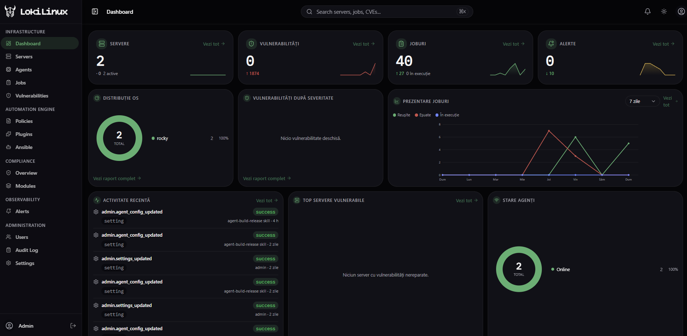
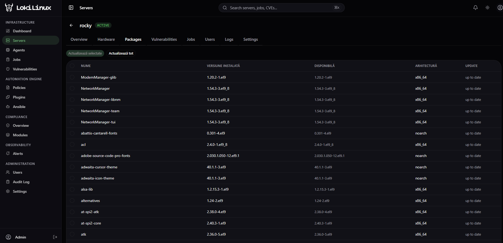
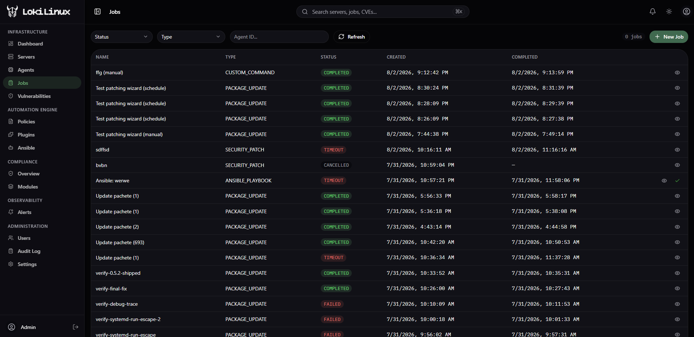
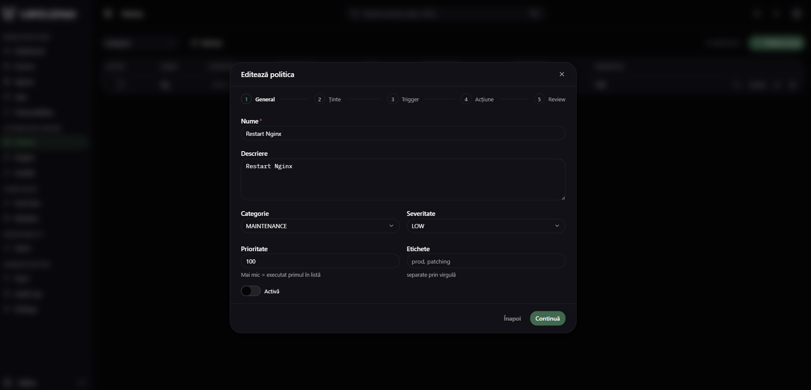
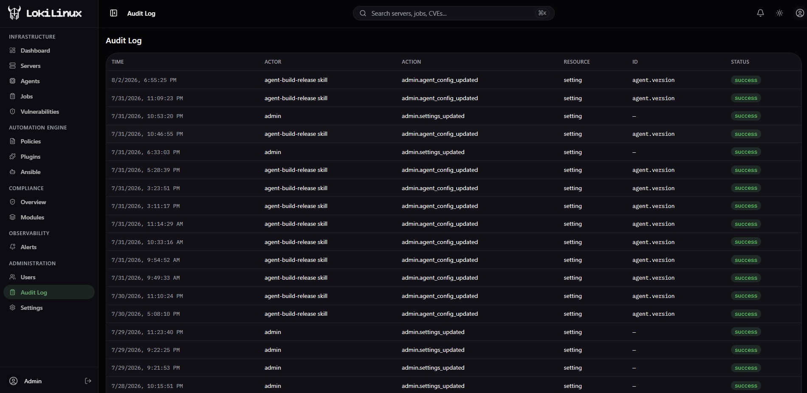

<!-- generated-by: gsd-doc-writer -->
# LokiLinux

Enterprise Linux fleet management platform — centralized patch management, vulnerability scanning, compliance automation, and remediation for 10K–100K+ Linux servers.

## Features

| Capability | What you get |
|------------|--------------|
| **Fleet inventory & health** | Every server reports OS/hardware/packages/services/listening ports on a 60s heartbeat; agents go INACTIVE automatically when heartbeats stop |
| **Patch management** | Package updates and security patches pushed as jobs, with maintenance windows, approval gates, and per-agent assignment |
| **Vulnerability tracking** | CVE catalog with fleet-wide impact (`/vulnerabilities`): summary, trends, top resources, patchable view, remediate / accept-risk / rescan workflows, CSV export |
| **Compliance & drift** | 24 built-in security collectors on each agent; snapshot ingest, drift detection with field-level diffs, CEL rule evaluation, scoring, versioned baselines, exceptions |
| **Automated remediation** | Remediation plans with dry-run → approve → execute → rollback lifecycle, dispatched inside maintenance windows |
| **Workflow automation** | Declarative YAML workflows (`lokilinux/v1`) with a visual builder: command/package/service/file/system steps, conditions, approvals, waits, notifications, webhooks; versioned + published like code |
| **Ansible automation** | AWX-like layer: projects, roles, playbooks (versioned), job templates — the live fleet is the inventory |
| **Plugin marketplace** | Marketplace-style install lifecycle for control-plane / agent / UI / notification plugins |
| **RBAC + audit** | Five roles (`ADMIN`, `MANAGER`, `OPERATOR`, `VIEWER`, `AUDITOR`) enforced across REST; audit log of user actions |

## Architecture

```
                  ┌──────────────────────────────────────┐
                  │         Frontend (Nuxt 4)            │
                  │    http://localhost:3000              │
                  │    Better Auth (identity provider)    │
                  └──────────────┬───────────────────────┘
                                 │ REST /api/v1 (same-origin proxy)
                  ┌──────────────▼───────────────────────┐
                  │       Control Plane (FastAPI)         │
                  │  REST :8000  │ gRPC :50051 (mTLS)     │
                  │       metrics :9090 (Prometheus)      │
                  └──────┬─────────────────┬─────────────┘
                         │                 │ compliance snapshots (NATS)
         ┌───────────────┼──────────┐      ▼
         │               ▼          │  ┌───────────────────────┐
         │   ┌──────────────┐       │  │ lokilinux-compliance  │
         │   │ PostgreSQL   │       │  │ (Go) — ingest, drift, │
         │   │+TimescaleDB  │       │  │ CEL rules, scoring,   │
         │   │+ pgBouncer   │       │  │ scheduling            │
         │   └──────────────┘       │  └───────────────────────┘
         │  ┌──────┐ ┌──────┐       │
         │  │ Redis│ │ NATS │───────┘  ┌───────────────────────┐
         │  └──────┘ └──────┘◄─────────┤   Linux Agents (Go)   │
         └─────────────────────────┬───┤   Static binary       │
                                   └──►│   Outbound-only mTLS  │
                                       │   60s heartbeat       │
                                       └───────────────────────┘
```

**Four layers:**

| Layer | Tech | Role |
|-------|------|------|
| **Control Plane** | FastAPI 0.138.1 (Python 3.11) + grpcio | REST API, gRPC server, job orchestration, CVE processing, Ansible automation, workflow engine, 15 background workers |
| **Linux Agent** | Go 1.24 (static binary, CGO_ENABLED=0) | Heartbeat with inventory + vulnerabilities + 24 compliance collectors; job, playbook, remediation and workflow-step execution |
| **Compliance Service** | Go 1.25 (pgx, CEL, NATS JetStream) | CPU-bound hot path: snapshot ingest, drift detection, rule evaluation, scoring, assessment scheduling |
| **Frontend** | Nuxt 4.5.2 + Vue 3.5 + TypeScript | Dashboard, fleet management, compliance UI, visual workflow builder, Ansible automation UI, plugin marketplace, user admin |

**Data flows:**

1. *Heartbeat (agent → control plane)* — agent dials out via mTLS gRPC every 60s carrying system info, packages (delta-synced via SHA-256 checksum), vulnerabilities, job results and per-domain compliance hashes → receives pending jobs, policy delta and resync requests in the response.
2. *Compliance pipeline* — the gRPC servicer publishes snapshots to NATS JetStream (`lokilinux.compliance.*`) → the Go service ingests, diffs against baselines, evaluates CEL rules, computes scores → results flow back to the API workers as drift/score events.
3. *User traffic* — the frontend calls `/api/v1` through a same-origin proxy; long-running work is decoupled onto NATS workers so REST stays fast.

## Screenshots

| Dashboard | Servers |
|-----------|---------|
|  |  |

| Jobs | Policies | Audit |
|------|----------|-------|
|  |  |  |

## Infrastructure Components

| Service | Technology | Port | Purpose |
|---------|-----------|------|---------|
| `lokilinux-frontend` | Nuxt 4 (Node 22) | 3000 | Web UI + Better Auth |
| `lokilinux-api` | FastAPI + uvicorn + grpcio | 8000, 9090 | REST API + Prometheus metrics |
| `lokilinux-grpc` | grpcio + mTLS | 50051 | Agent communication |
| `lokilinux-compliance` | Go (pgx, CEL, NATS JetStream) | 8080, 9091 | Compliance hot path: ingest, drift, rules, scoring, scheduling |
| `postgres` | TimescaleDB 2.28.1 (PG17) | 5432 | Primary DB + time-series |
| `pgbouncer` | pgBouncer (transaction mode) | 6432 | Connection pooling |
| `redis` | Redis 7.4.9 | 6379 | Cache (AOF, allkeys-lru) |
| `nats` | NATS 2.10.29 + JetStream | 4222, 8222 | Event bus |
| `lokilinux-migrate` | Alembic | — | One-shot DB migrations |

## Module Documentation

Detailed per-module documentation (Romanian, generated from code at v0.3.0) lives in [`docs/modules/`](docs/modules/):

| Document | Module | Covers |
|----------|--------|--------|
| [`00-index.md`](docs/modules/00-index.md) | Overview | Application map, cross-cutting principles, reading guide |
| [`01-frontend.md`](docs/modules/01-frontend.md) | Frontend | Pages, Pinia stores, Better Auth wiring, same-origin API proxy |
| [`02-control-plane.md`](docs/modules/02-control-plane.md) | Control Plane | All REST endpoints, gRPC service, 15 NATS workers, topic map |
| [`03-agent.md`](docs/modules/03-agent.md) | Linux Agent | Heartbeat loop, job dispatch, mTLS client, 24 compliance collectors, agent.yaml config |
| [`04-compliance.md`](docs/modules/04-compliance.md) | Compliance Service | Ingest pipeline, drift detector, CEL rules, leader election, scheduler |
| [`05-workflow-engine.md`](docs/modules/05-workflow-engine.md) | Workflow Engine | YAML compilation, versioning/publish, run advancement, agent step execution |
| [`06-infrastructura.md`](docs/modules/06-infrastructura.md) | Infrastructure | Docker services, volumes, mTLS certificates, dev vs production |

English deep-dive on the compliance subsystem only: [`docs/compliance/00-OVERVIEW.md`](docs/compliance/00-OVERVIEW.md) … `13-OPS.md`. Full-stack snapshot (as of an earlier commit): [`docs/ARCHITECTURE.md`](docs/ARCHITECTURE.md).

## Quick Start

### Prerequisites
- Docker 24+
- Docker Compose v2
- `make`

### First run

```bash
# 1. Create and edit environment file
cp .env.example .env
# Edit .env — set passwords, hostname, secrets

# 2. Full initialization (certs → build → start → migrate → admin user)
make init

# Or step by step:
make certs    # Generate CA + mTLS certificates
make build    # Build all Docker images
make up       # Start the stack
```

After `make init` completes, the admin credentials are printed to the terminal.

For local development with hot-reload, use `make dev` instead of `make up` (uses `docker-compose.dev.yml` to expose Postgres/pgBouncer/NATS ports locally).

### Access points

| URL | Description |
|-----|-------------|
| `http://localhost:3000` | Web UI |
| `http://localhost:8000/docs` | API docs (Swagger) |
| `http://localhost:8000/health` | API health check |
| `nats://localhost:4222` | NATS (JetStream enabled) |

## First-Time Authentication

The default admin user is created automatically by `make init`.

- **Login page:** `http://localhost:3000/auth/login`
- **Email:** `admin@lokilinux.local`
- **Password:** randomly generated during init (printed at the end)

To set a known password beforehand, add to `.env`:

```bash
ADMIN_EMAIL=admin@lokilinux.local
ADMIN_PASSWORD=your-secure-password
```

Auth is handled by **Better Auth** (embedded in the Nuxt frontend). The backend validates Bearer tokens against Better Auth's session endpoint — it never stores passwords itself.

| Role | Can |
|------|-----|
| `ADMIN` | Everything: users, roles, global settings, agent config, audit |
| `MANAGER` | Approve jobs/remediation plans/workflow steps, manage policies and baselines |
| `OPERATOR` | Launch jobs, playbooks, workflows; acknowledge alerts; edit inventory assignments |
| `VIEWER` | Read-only access to dashboards and inventories |
| `AUDITOR` | Read-only + audit log access, for compliance review |

## Ansible Automation

An AWX-like automation layer runs alongside patch management, built on 4 entities:

| Entity | Purpose |
|--------|---------|
| **Projects** (`ansible_projects`) | Group playbooks; `default_agent_ids` acts as the project's inventory (the live fleet is the inventory — no static hosts files) |
| **Roles** (`ansible_roles`) | Reusable file sets stored as a JSONB path→content map, materialized under `<tmpdir>/roles/<name>/` at execution time |
| **Playbooks** (`playbooks`) | Raw YAML, versioned on every edit, optionally scoped to a project and linked to `role_ids` |
| **Job Templates** (`playbook_templates`) | Saved (playbook + default agents + default extra_vars) combo — the AWX "Job Template" equivalent, launchable repeatedly |

The whole layer is plugin-gated (`require_plugin_enabled("ansible-automation")` — 403 unless enabled in `/plugins`). Execution is snapshot-based (roles + playbook content are embedded into the job, so later edits never affect running jobs) and runs locally on each agent via `ansible-playbook --connection=local` through argv-only invocation and a systemd transient unit — no shell interpolation of user YAML. Full analysis: [`docs/modules/07-ansible.md`](docs/modules/07-ansible.md).

## Plugin System

`plugins.py` + the `plugins` table track a marketplace-style install lifecycle: `PENDING_INSTALL → INSTALLING → INSTALLED → ENABLED` (or `INSTALLING_FAILED` / `DISABLED` / `ERROR`). Plugin types: control-plane, agent, ui, notification. Agent-side plugins are dropped into `/opt/lokilinux/plugins/` on the managed host. UI lives at `/plugins`.

## Workflow Engine

Fleet automation as declarative YAML (`apiVersion: lokilinux/v1`, `kind: Workflow`) with a visual builder at `/workflows`:

- **Step types**: `COMMAND`, `ANSIBLE`, `PACKAGE`, `SERVICE`, `FILE`, `SYSTEM` (agent actions) + `CONDITION`, `APPROVAL`, `WAIT`, `WAIT_FOR_AGENT`, `CHECK`, `VALIDATION`, `NOTIFICATION`, `WEBHOOK` (flow control).
- **Lifecycle like code**: every save creates an immutable version; only *published* versions can run; `POST /workflows/{id}/dry-run` validates the graph without side effects.
- **Execution**: runs advance server-side (5s poller); agent-facing steps are coalesced into a single `WORKFLOW_STEPS` job per heartbeat round-trip. Triggers: manual or scheduled.
- **Human gates**: `APPROVAL` steps pause the run until someone hits approve/reject (audited in `workflow_audit`).
- Policies can be migrated into workflows via `POST /policies/{id}/migrate`.

Details: [`docs/modules/05-workflow-engine.md`](docs/modules/05-workflow-engine.md).

## Compliance & Drift Management

Hybrid architecture — CPU-bound work in Go, user-facing CRUD in FastAPI:

1. **Collect** — the Go agent ships 24 compile-time security collectors (sshd, sysctl, PAM, sudo, auditd, firewall, SELinux, kernel, cron, systemd units, network, time sync, kernel modules, open ports, processes, capabilities, certificates, repositories, container runtime, file integrity, ...). Each domain's facts are normalized and content-hashed locally.
2. **Transport** — heartbeats carry only the per-domain hashes; the gRPC servicer publishes snapshots to NATS JetStream and requests full bodies (`resync_domains`) when hashes drift.
3. **Evaluate** — `lokilinux-compliance` (Go) ingests snapshots, detects field-level drift, evaluates CEL rules, computes scores, schedules assessments (leader-elected via NATS KV so a single instance dispatches).
4. **Manage** — versioned baselines (submit → approve → publish → rollback), policy sets + assignments, exceptions with approval, remediation plans dispatched back through the normal job engine.

Details: [`docs/modules/04-compliance.md`](docs/modules/04-compliance.md) (RO) and the full spec series [`docs/compliance/`](docs/compliance/) (EN).

## Makefile Targets

### Stack

```bash
make up       # Start production stack (detached)
make down     # Stop all containers
make build    # Build all Docker images
make dev      # Start with hot-reload (dev mode)
make logs     # Tail all service logs
make ps       # Show container status
make init     # First-run initialization
```

### Agent

```bash
make agent-build         # Build static binary (linux/amd64)
make agent-build-arm64   # Build static binary (linux/arm64)
make agent-package       # .tar.gz + .deb + .rpm for both arches
make agent-test          # Run agent tests with race detector
```

### Other

```bash
make proto    # Regenerate Go + Python from proto/*.proto
make certs    # Generate CA + server certificates
```

## Development

- **Hot-reload stack**: `make dev` — dev Dockerfiles (`uvicorn --reload`, `npm run dev`), bind-mounted sources, all infrastructure ports exposed locally (5432, 6432, 4222, 6379), verbose Postgres query logging.
- **Backend tests**: `pytest` from `backend/` (suites in `backend/tests/unit/` and `backend/tests/integration/`, async via pytest-asyncio).
- **Agent tests**: `make agent-test` (Go test with race detector).
- **Frontend tests**: `npm test` in `frontend/` (vitest run).
- **Protocol changes**: edit `proto/lokilinux.proto`, then `make proto`. Note: the wire format is JSON encoded under gRPC's `"proto"` codec name on both sides — see [`docs/modules/03-agent.md`](docs/modules/03-agent.md) for the rationale and swap path to binary protobuf.

## Docker Compose Structure

`docker-compose.yml` defines 9 services on a shared `lokilinux-network`. All long-running services have health checks. `lokilinux-migrate` runs `alembic upgrade head` once and exits.

Service dependencies: `postgres` → `pgbouncer` → `lokilinux-migrate` → `lokilinux-api` / `lokilinux-grpc` / `lokilinux-compliance` → `lokilinux-frontend`

`docker-compose.dev.yml` is a dev override (used by `make dev`) that exposes Postgres, pgBouncer, and NATS ports locally and enables verbose Postgres query logging.

## Directory Structure

```
lokilinux/
├── backend/              # FastAPI application
│   ├── lokilinux/
│   │   ├── api/v1/       # REST routers (servers, jobs, cves, policies, workflows, playbooks, ansible-projects, ansible-roles, playbook-templates, plugins, alerts, admin, agent-install, dashboard, categories + compliance/* sub-package)
│   │   ├── api/grpc/     # gRPC service handlers
│   │   ├── auth/         # JWT validation, role dependencies
│   │   ├── models/       # SQLAlchemy ORM models
│   │   ├── schemas/      # Pydantic API schemas
│   │   ├── services/     # Business logic
│   │   └── workers/      # NATS async consumers
│   ├── alembic/          # Alembic migrations
│   └── Dockerfile
├── agent/                # Go agent
│   ├── cmd/agent/        # Entry point
│   ├── internal/
│   │   ├── agent/        # Manager loop (heartbeat + job dispatch)
│   │   ├── compliance/   # 24 built-in security collectors + runner (content-hashed domains)
│   │   ├── communication/# gRPC client (mTLS, JSON codec)
│   │   ├── modules/      # system_info, packages, vuln, jobs, ansible_executor, remediation_executor, workflow_steps_executor, plugin_installer
│   │   └── storage/      # SQLite cache
│   └── .nfpm.yaml        # Package config (.deb/.rpm)
├── frontend/               # Nuxt 4 application
│   ├── pages/            # File-based routing (servers, jobs, alerts, policies, vulnerabilities, compliance, workflows, plugins, automation/ansible/*, admin/*)
│   ├── stores/           # Pinia stores
│   ├── composables/      # useAuth, useServers, useJobs, etc.
│   ├── server/           # Better Auth API handler + middleware
│   └── Dockerfile
├── services/compliance/    # Go microservice — compliance hot path (ingest, drift, rules, scoring, scheduler)
├── proto/                # Protobuf definitions
│   └── lokilinux.proto
├── scripts/              # docker-init.sh, init-certificates.sh, install-agent.sh, loki-cli.sh, rebuild.sh
├── docs/                 # Architecture specifications + plugin-sdk (Go, Python)
├── docker-compose.yml
├── docker-compose.dev.yml
└── Makefile
```

## Essential Environment Variables

| Variable | Purpose |
|----------|---------|
| `POSTGRES_USER` | Database user (default: `lokilinux`) |
| `POSTGRES_PASSWORD` | Database password |
| `POSTGRES_DB` | Database name (default: `lokilinux`) |
| `REDIS_PASSWORD` | Redis password |
| `BETTER_AUTH_SECRET` | Better Auth signing secret |
| `ADMIN_EMAIL` | Default admin email |
| `ADMIN_PASSWORD` | Default admin password |
| `PLATFORM_HOSTNAME` | Server hostname (for certs) |
| `AGENT_VERSION` | Agent binary version (default: `0.35.3`) |
| `LOG_LEVEL` | Logging level (default: `info`) |
| `DATABASE_URL` | Async SQLAlchemy connection string |
| `NATS_URL` | NATS event bus connection string |
| `REDIS_URL` | Redis connection string |
| `ENVIRONMENT` | `development` \| `production` |
