<!-- generated-by: claude -->
# Infrastructure Compliance & Drift Management — Architecture Overview

## 1. What this module is

Today LokiLinux answers "what's installed and vulnerable" (CVE/package tracking) and "what
job ran where" (Job Engine). It has no answer to the CAPA-shaped question every regulated
fleet operator eventually asks: **what configuration *should* this server have, how does it
differ today, who changed it, and how do I fix it — continuously, at 100,000-server scale.**

This module closes that gap: Baseline Manager, Inventory Collector, Drift Detection, Policy
Engine, Remediation Engine, AI Compliance Assistant, Compliance Dashboard, Historical Audit,
Reporting Engine, Automation Integration. It ships as a **core LokiLinux module**, not a
sibling product — one docker-compose stack, one auth model, one job engine, one UI shell.

## 2. Premise correction (read before the rest of this doc)

The original brief specifies Go + Fiber backend and React + shadcn/ui frontend. The actual
repository is **FastAPI 0.138 (Python 3.11)** + **Nuxt 4 / Vue 3.5 / Pinia**, with a Go agent
that has **no plugin interface today** (collectors are hardcoded struct fields, see
[03-AGENT-PLUGIN-SDK.md](03-AGENT-PLUGIN-SDK.md)). This document set designs against the real
stack. Per the approved plan, the compliance module is **hybrid**:

- A new Go microservice (`lokilinux-compliance`) for the CPU-bound hot path — snapshot ingest,
  drift diff, rule evaluation, scoring, scheduling — where Go's concurrency and the existing
  agent's Go codebase are a natural fit, and where a 100k-fleet workload would strain an
  `asyncio` process.
- The **existing FastAPI service** for everything user-facing — CRUD, approvals, RBAC, audit,
  reports. It inherits `get_current_user`, `require_role`, `RedisCache`, `CursorPage`,
  `AuditService`, and the Job Engine for free; duplicating those in Go would be waste.
- The **existing Nuxt frontend** for the UI — new pages under `pages/compliance/`, same
  `useApi()`, same `DataTable`/`Dialog`/`AppTabs` primitives, same Better Auth session.

This is not "two products bolted together" — the Go service is invisible to end users, talks
only to Postgres and NATS, and every operator-facing action still flows through the one
existing API surface and the one existing job pipeline.

## 3. Facts about the existing platform that shape every decision below

Discovered by exploring the live codebase (not assumed from the brief); each one changes the
design, so each gets a design response in §5.

| Fact | Evidence | Consequence |
|---|---|---|
| The job→agent wire path is **broken** in three independent ways | `agent/internal/communication/grpc_client.go:311` (`responseToMap` reads `resp.ExecuteJob`, server sends key `pending_jobs`); `backend/lokilinux/api/grpc/agent_service.py:79` (yields `{"pending_jobs": [...]}`, a list, into a proto `oneof`); `agent/internal/agent/manager.go:262` (asserts `job["parameters"].(map[string]interface{})` against a wire type of `map[string]string`) | No job dispatched via heartbeat response executes today. Remediation cannot ship until this is fixed — **Phase 0**, not part of this module's "new feature" surface, but a hard blocker for it |
| There is **no scheduler** anywhere in the backend | grep across `backend/lokilinux/` for `apscheduler\|celery\|croniter\|cron` — zero hits; `Job.scheduled_time` is stored but nothing ever reads it (`models/job.py:47`) | Scan cadence, maintenance windows, and drift sweeps need a new primitive — designed in the Go service, not bolted onto FastAPI as a second cron system |
| Agent collectors run **inline in the 60s heartbeat goroutine**, synchronously | `agent/internal/agent/manager.go:149-176` | An expensive compliance scan (thousands of file hashes, CIS rule eval) cannot run on that goroutine without delaying every heartbeat — needs its own cadence and worker pool on the agent |
| **No LLM/vector dependency exists** in the backend | `backend/pyproject.toml` has no `anthropic`/`openai`/`pgvector`; migration `001` creates only `pgcrypto`, `pg_trgm`, `timescaledb` | AI Assistant is 100% new: SDK dependency, `pgvector` extension, new config keys |
| **No charting library** exists in the frontend | `frontend/package.json` — no chart.js/ECharts/Recharts/Unovis; existing charts are hand-rolled inline SVG (`components/dashboard/OsDistributionDonut.vue`) | Heatmaps/risk-matrix/trend charts need one new frontend dependency (§5, D9) |
| `policy_audit` table exists with **zero writers**; `lokilinux.policy.apply` NATS topic is published with **zero subscribers**; the agent's local SQLite store (`agent/internal/storage/sqlite.go`) is fully schema'd but **almost entirely unused** | `backend/lokilinux/workers/policy_worker.py` only invalidates cache; `rg 'PolicyAudit\('` finds no INSERT; agent `EnqueueJob`/`PendingJobs`/`UpsertPackagesCache` are dead code | Free real estate — this module activates `policy_audit` for its own audit trail and the agent SQLite store for offline baseline/drift state, instead of inventing parallel tables |
| Vulnerability data ingest from heartbeat is a documented gap (proto field `vulnerabilities` exists, servicer never reads it) | `backend/lokilinux/api/grpc/agent_service.py:52-75` | Out of scope here, but the `AgentVulnerability(agent_id, rule_id, status, remediation_job_id)` shape is the pattern this module's `rule_evaluations` table follows |

## 4. Submodule map

```
Infrastructure Compliance & Drift Management
├── Baseline Manager            → 06-BASELINE.md
├── Inventory Collector         → 03-AGENT-PLUGIN-SDK.md, 04-PROTOCOL.md
├── Configuration Drift Detection → 08-DRIFT-FIM.md
├── Compliance Policy Engine    → 07-POLICY-ENGINE.md
├── Remediation Engine          → 09-REMEDIATION.md
├── AI Compliance Assistant     → 10-AI.md
├── Compliance Dashboard        → 11-FRONTEND.md
├── Historical Audit            → 01-DATA-MODEL.md §audit, 12-DIAGRAMS.md
├── Reporting Engine            → 05-API.md §reports, 13-OPS.md
└── Automation Integration      → 09-REMEDIATION.md §providers
```

## 5. Architecture decisions (D1–D9)

### D1 — Hybrid topology

```mermaid
flowchart LR
    Agent["Go Agent<br/>(fleet host)"] -- "mTLS gRPC :50051<br/>heartbeat + domain_hashes" --> GrpcSvc["lokilinux-grpc<br/>(existing, FastAPI+grpcio)"]
    GrpcSvc -- "publish per-domain snapshot" --> NATS[("NATS JetStream")]
    NATS --> Compliance["lokilinux-compliance<br/>(NEW, Go)<br/>ingest · diff · evaluate · score · schedule"]
    Compliance -- "read/write" --> PG[("PostgreSQL / TimescaleDB")]
    API["lokilinux-api<br/>(existing, FastAPI)<br/>/api/v1/compliance/*"] -- "read/write" --> PG
    Compliance -- "publish results" --> NATS
    API -- "subscribe" --> NATS
    UI["Nuxt frontend<br/>pages/compliance/*"] -- "/api/v1 (proxied)" --> API
    API -- "create Job (remediation)" --> JobEngine["Job Engine (existing)"]
    JobEngine -- "pending_jobs on next heartbeat" --> Agent
```



- `lokilinux-compliance` is stateless, horizontally scaled by NATS JetStream queue groups
  (`durable` consumer per replica, `max_ack_pending` bounds in-flight work). It exposes only
  `/healthz` and `/metrics` (Fiber, matching the CLAUDE.md-listed stack for a new Go service) —
  no public REST surface, no auth logic, no user-facing anything.
- It never touches Better Auth, Redis, or the job dispatch path directly. Rule evaluation
  results and drift events land in Postgres; `lokilinux-api` reads them for the UI and creates
  remediation Jobs through the existing `JobService`.
- No new agent port. Snapshots ride the existing `HeartbeatStream` (D2); the Python gRPC
  servicer does a thin passthrough — deserialize, republish to NATS — rather than any
  compliance logic itself, keeping the CPU-bound work in Go.

### D2 — Per-domain delta sync

Sending full configuration state (sshd_config, sysctl, users, mounts, …) on every 60s
heartbeat for 100k agents is wasteful — most domains don't change between beats. The agent
normalizes each domain into a canonical JSON document, hashes it (BLAKE3, matching the
existing `packageChecksum` pattern at `agent/internal/modules/package_manager.go:123` but
extended fleet-wide), and the heartbeat carries only `domain_hashes: {sshd: "...", sysctl:
"...", ...}`. The server diffs against `inventory_snapshots.content_hash` and returns
`resync_domains: [...]` for anything stale or missing; only those domains' full bodies are
sent on the *next* heartbeat. Full detail in [04-PROTOCOL.md](04-PROTOCOL.md).

### D3 — Content-addressable snapshot storage

The scaling problem isn't 100k agents — it's 100k agents running maybe a few hundred distinct
golden images. `inventory_blobs(content_hash PK, body BYTEA zstd-compressed, algo, size)`
stores each unique normalized document exactly once; `inventory_snapshots` rows are cheap
`(agent_id, domain, content_hash, taken_at)` pointers. A fleet-wide sshd_config rollout that's
identical across 50,000 hosts costs one blob row, not 50,000. Same trick for `file_hashes`.
Full schema in [01-DATA-MODEL.md](01-DATA-MODEL.md).

### D4 — Rule content sourced from ComplianceAsCode (SCAP Security Guide)

Hand-writing CIS/STIG/PCI-DSS/NIST/ISO27001 rule content is the single most expensive part of
a compliance product and is already solved, open-source, and continuously maintained upstream
by [ComplianceAsCode/content](https://github.com/ComplianceAsCode/content) (the project behind
`scap-security-guide`). An importer ingests that repo's `rule.yml` definitions (severity,
rationale, `references` block mapping CIS/STIG/PCI/NIST/ISO control IDs, `platform`/`prodtype`
applicability), its bash/ansible remediation snippets, and its `.profile` files (→ our
`policy_sets`, e.g. `cis_ol9`, `stig_rhel9`, `pci-dss`). **Evaluation itself does not shell out
to `oscap`/OVAL** — each rule's check is re-expressed as a **CEL** expression
(`github.com/google/cel-go`) evaluated in-process against the agent's normalized fact
document: sandboxed, no arbitrary code execution, and fast enough to run rule-set-wide per
snapshot at fleet scale. Rules without a hand-mapped CEL check are marked
`check_source=OVAL_UNMAPPED` with an explicit coverage percentage surfaced in the dashboard —
honest gap-tracking rather than a silent "compliant by default." Full pipeline in
[07-POLICY-ENGINE.md](07-POLICY-ENGINE.md).

### D5 — Baseline as a scope tree

`scope_type ∈ {GLOBAL, OS, ROLE, ENVIRONMENT, DATACENTER, CLUSTER, APPLICATION}` +
`scope_selector` JSONB + `parent_baseline_id`, matching the brief's `Oracle Linux 9 → Database
Servers → Production → v1.3` example. The effective baseline for a given agent is computed by
merging matching baselines most-specific-wins, materialized into `baseline_effective` and
cached in Redis. Versions are immutable and Ed25519-signed;
`DRAFT → PENDING_APPROVAL → APPROVED → PUBLISHED → DEPRECATED`; rollback re-publishes an old
version rather than mutating history. Full design in [06-BASELINE.md](06-BASELINE.md).

### D6 — Remediation rides the existing Job Engine

`JobService.create_job(job_type="COMPLIANCE_REMEDIATE", target_servers={"agent_ids": [...]},
requires_approval=True, ...)` (`backend/lokilinux/services/job_service.py:123`) already gives
dedup-by-hash, per-agent fan-out via `JobResult` rows, approval gating, and status aggregation
via `recompute_job_status`. `remediation_plans` (grouping findings → actions) and
`remediation_jobs` (join table, mirroring `AgentVulnerability.remediation_job_id`) sit on top
rather than reinventing dispatch. Providers: Ansible (executor already exists on the agent,
`agent/internal/modules/ansible_executor.go`), shell (ditto), Python and Terraform as future
providers behind the same interface. Full workflow in [09-REMEDIATION.md](09-REMEDIATION.md).

### D7 — AI Assistant is provider-agnostic

No LLM dependency exists today, so nothing is locked in. `LLMProvider` is an ABC in
`lokilinux/ai/providers/` with `anthropic`, `openai`, `ollama`, and `vllm` implementations
selected via `settings_schema.py` (so an on-prem/regulated customer can point at a local vLLM
or Ollama instance instead of a hosted API — a real requirement for a product marketed at
compliance-conscious enterprises). RAG runs on `pgvector` (new extension, first addition since
`timescaledb`). The planner has tool-calling access to a **read-only** Tool API; any tool that
would mutate state instead writes an `ai_recommendations` row, and only human approval turns
that into a real Job. Full architecture in [10-AI.md](10-AI.md).

### D8 — Scheduler is a new primitive, in the Go service

Building on the observation that no scheduler exists anywhere in this codebase (§3), scan
cadence, maintenance windows, and drift sweeps are implemented once, in `lokilinux-compliance`,
using NATS KV for leader election among replicas — not APScheduler, not Celery, and not a
second competing scheduler bolted onto FastAPI. This also finally exercises `Job.scheduled_time`,
which today is written but never dispatched. Full design in [02-GO-SERVICE.md](02-GO-SERVICE.md).

### D9 — One new frontend dependency

Everything reuses existing primitives (`DataTable`, `Dialog`, `AppTabs`, `useApi`, Pinia
setup-stores) except heatmaps/trend lines/risk-matrix, which need real charting — the existing
inline-SVG approach doesn't scale to that. `@unovis/vue` is the one new dependency (Vue-native,
tree-shakeable, no CSS framework lock-in). `components/ui/Badge.vue` gains `amber`/`orange`
variants (today only `red`/`green`/`gray`) for medium-severity findings. Full page/component
plan in [11-FRONTEND.md](11-FRONTEND.md).

## 6. Phase 0 — prerequisites this module depends on but does not itself deliver

Documented here so they're tracked, not silently assumed. None of these are "compliance
features" — they're existing-platform bugs/gaps that block this module's remediation path:

1. **Fix the job→agent wire** (§3, row 1) — either the server sends
   `{"execute_job": {...}}` one job at a time instead of `{"pending_jobs": [...]}`, or the
   agent's `AgentHeartbeatResponse` gains a repeated `pending_jobs` field and
   `JobRequest.Parameters` changes from `map[string]string` to a JSON-capable type on both
   ends. Without this fix, `COMPLIANCE_REMEDIATE` jobs are created and approved but never
   reach an agent.
2. **A subscriber for `lokilinux.policy.apply`** — published today by
   `backend/lokilinux/api/v1/routers/policies.py:175`, consumed by nobody.
3. **`AuditService` called from mutations outside `/admin`** — today only
   `routers/admin.py` writes to `audit_logs`; this module's baseline/policy/remediation
   mutations need the same discipline (§ Historical Audit, [01-DATA-MODEL.md](01-DATA-MODEL.md)).
4. **NATS JetStream** — already running (`nats:2.10.29-alpine` with `--js`,
   `docker-compose.yml`), confirmed available for the new durable consumers this module adds.

## 7. Document index

| Doc | Brief output # | Contents |
|---|---|---|
| [00-OVERVIEW.md](00-OVERVIEW.md) | 1, 2 | this document |
| [01-DATA-MODEL.md](01-DATA-MODEL.md) | 3, 19 | full PostgreSQL schema, hypertables, partitioning, retention |
| [02-GO-SERVICE.md](02-GO-SERVICE.md) | 4, 13, 16 | Go package structure, scheduler, interfaces |
| [03-AGENT-PLUGIN-SDK.md](03-AGENT-PLUGIN-SDK.md) | 5, 15, 16 | agent Plugin interface, collector list, per-distro handling |
| [04-PROTOCOL.md](04-PROTOCOL.md) | 17 | protobuf, JSON codec, delta sync, NATS messages, wire fix |
| [05-API.md](05-API.md) | 6, 18 | REST/gRPC/WebSocket API |
| [06-BASELINE.md](06-BASELINE.md) | — | Baseline Manager |
| [07-POLICY-ENGINE.md](07-POLICY-ENGINE.md) | 4 (policy) | Policy Engine + ComplianceAsCode import |
| [08-DRIFT-FIM.md](08-DRIFT-FIM.md) | — | Drift Detection + File Integrity |
| [09-REMEDIATION.md](09-REMEDIATION.md) | 10, 21 | Remediation Engine, Ansible integration |
| [10-AI.md](10-AI.md) | 11, 12 | AI Compliance Assistant, RAG |
| [11-FRONTEND.md](11-FRONTEND.md) | 7, 20 | Frontend page structure |
| [12-DIAGRAMS.md](12-DIAGRAMS.md) | 8, 9, 22 | Workflow/sequence diagrams, historical audit |
| [13-OPS.md](13-OPS.md) | 23, 24, 25, 26 | Scaling, security, deployment, roadmap, coverage table |
