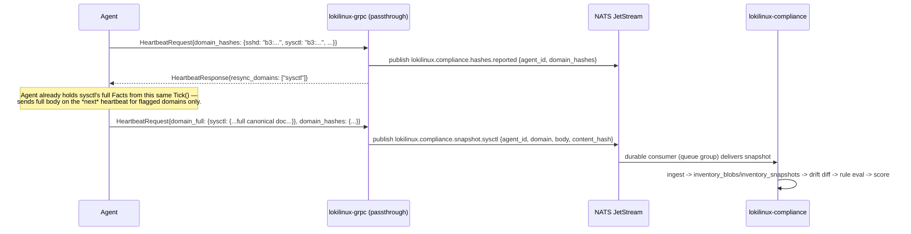

<!-- generated-by: claude -->
# Wire Protocol — Delta Sync, NATS Messages, and the Job-Dispatch Fix

## 1. Existing wire reality (must be understood before adding to it)

The agent↔control-plane wire is **not real protobuf**. Both sides register a codec that
overrides the wire name `"proto"` with plain JSON: agent side
`agent/internal/communication/grpc_client.go:23-34` (`jsonCodec`, `Marshal`/`Unmarshal` are
just `json.Marshal`/`json.Unmarshal`), server side `backend/lokilinux/grpc_server.py:19-26`
(`json.dumps`/`json.loads` with `object_hook=SimpleNamespace`). `proto/lokilinux.proto` exists
and `agent/gen/proto/lokilinux.pb.go` is real protoc output, but it's **imported nowhere** —
dead code. The types actually used are hand-written Go structs with `json:` tags in
`agent/gen/lokilinux/lokilinux.pb.go` (247 lines) plus a hand-rolled client in
`agent/gen/lokilinux/lokilinux_grpc.pb.go`.

**Practical consequence: adding a field to the heartbeat is a Go struct field + a Python
`getattr`, never a protoc regeneration.** This document's additions follow that same
convention rather than reintroducing real protobuf.

## 2. The job-dispatch wire is currently broken — Phase 0 fix (blocks remediation)

Three independent bugs, all on the response path, confirmed by reading both sides:

1. **Key mismatch.** The Python servicer yields `{"pending_jobs": [...]}`
   (`backend/lokilinux/api/grpc/agent_service.py:79-88`). The Go client unmarshals into
   `gen.AgentHeartbeatResponse`, whose only fields are `execute_job`/`update_policy`/
   `reboot_request`/`plugin_action` (`agent/gen/lokilinux/lokilinux.pb.go:34-39`) — there is no
   `pending_jobs` field and no custom `UnmarshalJSON`, so the whole list is silently dropped.
2. **Cardinality mismatch.** Even if the key matched, `AgentHeartbeatResponse` models a proto
   `oneof` (one command per response) while the server can return up to 10 pending jobs
   (`agent_service.py:235`, `.limit(10)`).
3. **Type mismatch.** `gen.JobRequest.Parameters` is `map[string]string`
   (`agent/gen/lokilinux/lokilinux.pb.go:176`), but `manager.go:262` asserts
   `job["parameters"].(map[string]interface{})` against it and the server sends nested JSON
   (`jobs.parameters` is JSONB) — neither side can actually carry a nested parameter value
   today.

**Fix (adopted by this module, implemented as part of Phase 0, before remediation ships):**

```go
// agent/gen/lokilinux/lokilinux.pb.go — change
type AgentHeartbeatResponse struct {
	PendingJobs   []*JobRequest `json:"pending_jobs,omitempty"`   // was: single oneof ExecuteJob
	UpdatePolicy  *PolicyConfig `json:"update_policy,omitempty"`
	RebootRequest string        `json:"reboot_request,omitempty"`
	PluginAction  string        `json:"plugin_action,omitempty"`
}

type JobRequest struct {
	JobID          string                 `json:"job_id"`
	JobType        string                 `json:"job_type"`
	Parameters     map[string]interface{} `json:"parameters"`   // was: map[string]string
	TimeoutSeconds int                    `json:"timeout_seconds,omitempty"`
}
```
```go
// agent/internal/communication/grpc_client.go — responseToMap, corrected
func responseToMap(resp *gen.AgentHeartbeatResponse) map[string]interface{} {
	if resp == nil { return nil }
	result := map[string]interface{}{}
	if len(resp.PendingJobs) > 0 {
		jobs := make([]interface{}, 0, len(resp.PendingJobs))
		for _, j := range resp.PendingJobs {
			jobs = append(jobs, map[string]interface{}{
				"job_id": j.JobID, "job_type": j.JobType,
				"parameters": j.Parameters, "timeout_seconds": j.TimeoutSeconds,
			})
		}
		result["pending_jobs"] = jobs
	}
	// ... update_policy / reboot / plugin_action unchanged
	return result
}
```
`agent/internal/agent/manager.go` already iterates `resp["pending_jobs"].([]interface{})` in
its dispatch loop (`manager.go:243-301`, quoted in [03-AGENT-PLUGIN-SDK.md](03-AGENT-PLUGIN-SDK.md)) —
once `parameters` is a real `map[string]interface{}`, the existing type assertion at
`manager.go:262` (`job["parameters"].(map[string]interface{})`) succeeds for the first time.
No server-side change needed — `agent_service.py:79-88` already emits the right key and shape;
the bug was entirely on the agent's typed layer. This is deliberately the smallest possible
diff: two struct shape changes, zero new RPCs, zero protobuf regeneration.

## 3. Delta sync (D2) — heartbeat additions

```go
// agent/gen/lokilinux/lokilinux.pb.go — AgentHeartbeatRequest gains one field
type AgentHeartbeatRequest struct {
	// ... existing fields (agent_id, system_status, packages, ...) unchanged
	DomainHashes map[string]string `json:"domain_hashes,omitempty"` // domain -> BLAKE3 of canonical facts
}
```

```python
# backend/lokilinux/api/grpc/agent_service.py — HeartbeatStream, additions alongside existing
# packages_checksum handling (agent_service.py:52-75 pattern)
domain_hashes = getattr(request, "domain_hashes", None) or {}
resync_domains = await compliance_service.diff_domain_hashes(agent.id, domain_hashes)
# ... included in the yielded response dict:
# {"pending_jobs": [...], "resync_domains": resync_domains}
```

Flow per heartbeat:



`domain_full` is a new optional map on `AgentHeartbeatRequest`, populated only for domains
named in the *previous* response's `resync_domains` — the server never gets a full body it
didn't ask for, and the agent never sends one preemptively. First-ever heartbeat for a new
agent has an empty server-side snapshot for every domain, so `resync_domains` naturally
contains everything once, seeding the baseline comparison — no special "initial sync" RPC
needed.

## 4. New NATS subjects

```python
# backend/lokilinux/nats_topics.py — additions, same file, same convention
# Compliance — snapshot ingest (published by grpc passthrough, consumed by lokilinux-compliance)
COMPLIANCE_HASHES_REPORTED = "lokilinux.compliance.hashes.reported"
COMPLIANCE_SNAPSHOT_DOMAIN = "lokilinux.compliance.snapshot"          # + ".{domain}" subject suffix per publish

# Compliance — results (published by lokilinux-compliance, consumed by lokilinux-api workers)
COMPLIANCE_DRIFT_DETECTED = "lokilinux.compliance.drift.detected"
COMPLIANCE_SCORE_UPDATED = "lokilinux.compliance.score.updated"
COMPLIANCE_BASELINE_PUBLISHED = "lokilinux.compliance.baseline.published"  # triggers baseline_effective recompute fleet-wide
```

`COMPLIANCE_SNAPSHOT_DOMAIN` is published as `lokilinux.compliance.snapshot.{domain}` (NATS
subject wildcarding) so the Go service's JetStream consumers can subscribe per-domain if a
domain's evaluation cost warrants dedicated scaling later, without a wire format change.

JetStream config for these subjects: `lokilinux.compliance.>` stream, `WorkQueue` retention
(each message consumed exactly once by the ingest pool), `max_msgs_per_subject` bounded per
domain to avoid unbounded growth if `lokilinux-compliance` is down — matches how the existing
NATS deployment already runs with `--js` (`docker-compose.yml`, `nats:2.10.29-alpine`).

## 5. `AgentHealth`/`Vulnerability` precedent this follows

This delta-sync design deliberately mirrors the one delta-detection mechanism that already
ships: `Agent.last_packages_checksum` short-circuiting `_sync_packages`
(`backend/lokilinux/services/agent_service.py:92`) when the package list hasn't changed. This
module generalizes that single special case into a general per-domain mechanism rather than
inventing a different pattern.
