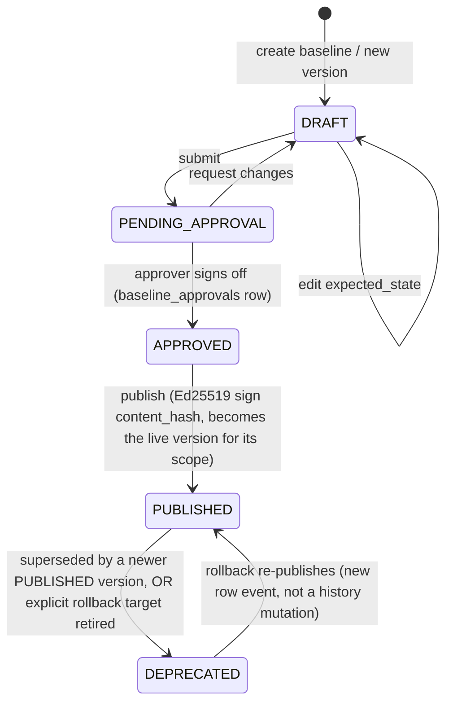

<!-- generated-by: claude -->
# Baseline Manager

## 1. Scope tree

Matches the brief's example exactly: `Oracle Linux 9 → Database Servers → Production →
v1.3`. Implemented as `scope_type` + `scope_selector` (JSONB) rather than a fixed hierarchy of
columns, because real fleets don't always nest cleanly (a datacenter-level rule and a
cluster-level rule can both apply to the same host without one containing the other):

```
GLOBAL                     scope_selector: {}
  OS                       scope_selector: {"os_distro": "ol", "os_version": "9"}
    ROLE                   scope_selector: {"role": "database"}
      ENVIRONMENT          scope_selector: {"environment": "production"}
        DATACENTER         scope_selector: {"datacenter": "us-east-1"}
          CLUSTER          scope_selector: {"cluster": "db-cluster-3"}
            APPLICATION    scope_selector: {"application": "postgres-primary"}
```

`parent_baseline_id` records the authored intent (this baseline was created "as a refinement
of" a parent) for UI breadcrumbing; it is **not** what drives merge order — merge order is
computed purely from `scope_type` specificity rank + whether `scope_selector` actually matches
the target agent's attributes (os_distro/os_version/role/environment/datacenter/cluster/
application, sourced from `Agent` columns + `Category`/`Project` tag assignments already in
`models/category.py`). This means a baseline doesn't need an explicit parent to participate in
a merge — any GLOBAL/OS/ROLE/... baseline whose selector matches contributes, ordered by rank.

## 2. Effective baseline computation

```go
// services/compliance/internal/baseline/resolver.go — merge algorithm
func (r *resolverImpl) Resolve(ctx context.Context, agentID string) (Effective, error) {
	agent := r.loadAgentAttrs(ctx, agentID) // os_distro, os_version, role, environment, datacenter, cluster, application

	candidates := r.loadPublishedBaselineVersions(ctx) // all PUBLISHED versions, cached
	matching := filterBySelectorMatch(candidates, agent)
	sortBySpecificity(matching) // GLOBAL < OS < ROLE < ENVIRONMENT < DATACENTER < CLUSTER < APPLICATION

	merged := map[string]any{}
	var versionIDs []string
	for _, v := range matching {
		deepMergeOverwrite(merged, v.ExpectedState) // later (more specific) wins per-key, not whole-document replace
		versionIDs = append(versionIDs, v.ID)
	}
	hash := blake3.Sum(canonicalJSON(merged))
	return Effective{AgentID: agentID, BaselineVersionIDs: versionIDs, MergedState: merged, MergedHash: hash}, nil
}
```

`deepMergeOverwrite` merges per-key, per-domain — an APPLICATION-scope baseline overriding
only `sshd.PermitRootLogin` doesn't blow away the OS-scope baseline's entire `sshd` domain,
only that one key. This is what makes "Version 1.3, database servers only, production only"
practical: authors only specify deltas from the more general baseline, not a full restatement.

Recomputed on: baseline publish (`COMPLIANCE_BASELINE_PUBLISHED`, fleet-wide invalidation),
agent attribute change (role/environment reassignment), and lazily on read if
`baseline_effective.computed_at` predates the newest matching `baseline_versions.published_at`.
Cached in Redis (`compliance:baseline:{agent_id}`, TTL matches `TTL_AGENT_STATUS` pattern in
`cache.py`) in addition to the Postgres materialization, for the hot read path (every
heartbeat's drift-vs-baseline compare).

## 3. Versioning, signing, approval workflow



Immutability rule: once a `baseline_versions` row reaches `PUBLISHED`, `expected_state` is
never updated in place — any further change creates a new version (`version = max+1`). This is
what makes "rollback" safe: it means "make an old version current again," recorded as a new
`APPROVED → PUBLISHED` transition on the *existing* old row (its `published_at` is updated,
`deprecated_at` cleared), never a rewrite of what that version's content actually was — an
auditor can always answer "what did v1.2 say, exactly" even after v1.4 rolls back to it.

**Signing:** on publish, the Go service computes `content_hash = BLAKE3(canonical(expected_state))`
and signs it with the platform's Ed25519 key (new keypair, stored the same way `certs/` already
stores the mTLS CA — a file under `/etc/lokilinux/certs/baseline-signing.key`, mounted
read-only into `lokilinux-compliance` only, never into the frontend or API container). Agents
that receive `baseline_effective` for enforcement-adjacent purposes (future: agent-local
enforcement, not required for v1's server-side-only drift detection) can verify the signature
against the CA's public key already present at `/etc/lokilinux/certs/ca.crt` — no new
distribution channel.

## 4. Approval workflow enforcement

`PENDING_APPROVAL → APPROVED` requires `require_role("ADMIN")` (matches the existing pattern
of approval-gated mutations, e.g. `jobs.py:172`'s `POST /jobs/{id}/approve`). A `DRAFT` author
cannot approve their own submission — enforced at the service layer by comparing
`baseline_versions.created_by` against the approver's user id, returning 403 on self-approval,
mirroring the spirit of `Job.approved_by` separation already implied by the existing job
approval flow (creator and approver are tracked as distinct columns there too).

## 5. Rollback

`POST /compliance/baselines/{id}/versions/{version_id}/rollback` (target must be a
`DEPRECATED` version of the *same* baseline) transitions the current `PUBLISHED` version to
`DEPRECATED` and the target version back to `PUBLISHED`, publishing
`COMPLIANCE_BASELINE_PUBLISHED` exactly as a forward publish would — every downstream
consumer (drift detection, dashboard) treats a rollback identically to a new publish, so there
is no special-cased "rollback mode" to keep in sync elsewhere in the system.

## 6. What baselines store (brief checklist, mapped to `expected_state` domains)

`expected_state` is one JSONB document keyed by the same `domain` strings the agent collectors
produce (`03-AGENT-PLUGIN-SDK.md` §2/§4) — packages, services, sysctl, sshd_config, firewall,
mount options, kernel parameters, users, groups, sudo, SELinux, audit rules, cron, repositories,
certificates all map 1:1 onto a collector domain, so the baseline author edits exactly the
shape the drift engine already diffs against — no separate "baseline schema" to keep in sync
with the collector schema.
