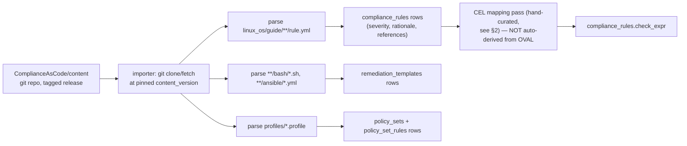

<!-- generated-by: claude -->
# Compliance Policy Engine

## 1. Content pipeline — ComplianceAsCode import

Per the approved decision (D4), rule *content* (severity, rationale, framework mappings,
remediation scripts) is sourced from the upstream
[ComplianceAsCode/content](https://github.com/ComplianceAsCode/content) project — the same
open, continuously-maintained corpus that ships as `scap-security-guide` on every major
distro. This module never hand-authors CIS/STIG/PCI/NIST/ISO27001 rule text; it imports it.



Importer entrypoint: `POST /api/v1/compliance/policy-sets/import` ([05-API.md](05-API.md) §2),
`ADMIN`-only, runs as a background Job (`job_type="COMPLIANCE_IMPORT_CONTENT"`) since a full
content import (thousands of rules) is too slow for a synchronous request. Idempotent on
`(rule_key, source_version)` — re-importing the same pinned version is a no-op; importing a
newer `content_version` creates new `remediation_templates` versions and updates
`compliance_rules` rows in place (rule content itself isn't versioned per-org the way baselines
are — it's upstream-versioned, tracked via `source_version`).

## 2. Evaluation — CEL, not OVAL

OVAL (the mechanism `oscap` uses) requires either shipping and invoking `oscap` on every agent
(a real binary dependency and a slower, harder-to-sandbox check path) or writing an OVAL
interpreter — neither fits a Go service designed for CEL and Go's existing agent constraints
(`CGO_ENABLED=0`, no arbitrary binary dependencies today). Instead, each rule's check is
re-expressed as a **CEL** expression evaluated by `lokilinux-compliance`
(`github.com/google/cel-go`) against the agent's normalized fact document for that rule's
`domain`:

```go
// services/compliance/internal/rules/cel_env.go
env, _ := cel.NewEnv(
	cel.Variable("facts", cel.MapType(cel.StringType, cel.DynType)),
)
// Example rule: sshd_disable_root_login
// check_expr: facts.sshd.PermitRootLogin == "no"

// Example rule: sysctl net.ipv4.ip_forward disabled
// check_expr: facts.sysctl["net.ipv4.ip_forward"] == "0"

// Example rule: /tmp mounted noexec
// check_expr: facts.mounts.exists(m, m.target == "/tmp" && "noexec" in m.options)
```

```go
func (e *celEvaluator) Evaluate(ctx context.Context, rule Rule, facts map[string]any) (Verdict, error) {
	if rule.CheckSource != CheckSourceCEL {
		return Verdict{Result: ResultNotEvaluated}, nil // OVAL_UNMAPPED — tracked, not silently passed
	}
	prg, err := e.compiled(rule.ID, rule.CheckExpr) // compiled programs cached per rule.ID
	if err != nil {
		return Verdict{Result: ResultError, Err: err}, nil
	}
	out, _, err := prg.Eval(map[string]any{"facts": facts})
	if err != nil {
		return Verdict{Result: ResultError, Err: err}, nil
	}
	pass, ok := out.Value().(bool)
	if !ok {
		return Verdict{Result: ResultError, Err: fmt.Errorf("check_expr did not return bool")}, nil
	}
	if pass {
		return Verdict{Result: ResultPass}, nil
	}
	return Verdict{Result: ResultFail}, nil
}
```

CEL's sandboxing (no I/O, no unbounded loops, cost-limited evaluation) is exactly the property
needed to run untrusted-ish, bulk-imported check logic across a fleet without any risk of a
malformed or malicious expression escaping its evaluation — an OVAL interpreter or a real
scripting language would need the same guarantee built by hand.

## 3. Coverage tracking — the honest alternative to silent pass-by-default

Upstream ComplianceAsCode rules are authored against OVAL, not CEL — a full 1:1 remapping of
every rule across every supported profile is a large, ongoing effort. Rules without a
hand-curated `check_expr` are imported with `check_source = 'OVAL_UNMAPPED'` and evaluate to
`NOT_EVALUATED`, **never** silently to `PASS`. Coverage is a first-class, always-visible metric:

```sql
-- powers GET /api/v1/compliance/rules/{rule_id}/coverage and the fleet coverage widget
SELECT policy_set_id,
       count(*) FILTER (WHERE cr.check_source = 'CEL') AS mapped,
       count(*) FILTER (WHERE cr.check_source != 'CEL') AS unmapped,
       round(100.0 * count(*) FILTER (WHERE cr.check_source = 'CEL') / count(*), 1) AS coverage_pct
FROM policy_set_rules psr
JOIN compliance_rules cr ON cr.id = psr.rule_id
GROUP BY policy_set_id;
```

An optional `OSCAP_FALLBACK` path exists for organizations that want full OVAL fidelity on a
specific host class badly enough to accept the operational cost: the agent can shell out to a
locally-installed `oscap xccdf eval` (binary must already be present — the agent never installs
it) and report parsed ARF/XCCDF results back through the *same* `rule_evaluations` table with
`check_source='OSCAP_FALLBACK'`. This is opt-in per policy assignment, off by default, and
never required for the module to function — coverage percentage is the honest default, not a
forcing function to deploy `oscap` everywhere.

## 4. Scoring

```sql
-- one row per (agent, category, scan run) — computed by lokilinux-compliance after each
-- rule-evaluation pass for an agent, written to compliance_scores
category_score = 100.0 * passed_count / NULLIF(passed_count + failed_count, 0)
```

Categories (`security`, `configuration`, `filesystem`, `packages`, `kernel`) are a fixed
mapping from `compliance_rules.domain` (§ domain list in
[03-AGENT-PLUGIN-SDK.md](03-AGENT-PLUGIN-SDK.md)) to one of the five brief-specified buckets —
e.g. `sshd`/`pam`/`auditd`/`sudo` → `security`; `sysctl`/`systemd_services`/`cron` →
`configuration`; `mounts`/`file_integrity` → `filesystem`; package inventory (reusing the
existing `packages` table, not duplicating it) → `packages`; `kernel`/`kernel_modules` →
`kernel`. `overall` is the unweighted mean of the five, matching the brief's dashboard example
(`Compliance 98%`, five sub-scores, `Trend +4%`). Fleet/cluster/environment/datacenter scores
are `avg(category_score)` grouped by the matching `Agent`/`Category` attributes, pre-aggregated
via `compliance_scores_daily` ([01-DATA-MODEL.md](01-DATA-MODEL.md) §4) for the trend chart.
`NOT_APPLICABLE` and `NOT_EVALUATED` results are excluded from both numerator and denominator —
a rule that doesn't apply to a host, or that has no CEL mapping yet, never drags the score down
or artificially inflates it.

## 5. Policy versioning, editability, import/export

`policy_sets`/`policy_set_rules` support the brief's "policies versioned, editable, editable,
import/export" requirements directly: editing a policy set (add/remove a rule, override a
severity via `policy_set_rules.severity_override`) is a normal mutation, audited via
`AuditService` + the now-activated `policy_audit` table
([01-DATA-MODEL.md](01-DATA-MODEL.md) §9). Export (`GET /policy-sets/{id}/export`) serializes to
the same JSON/YAML shape the importer consumes, so a policy set edited in the UI can be
git-committed and re-imported elsewhere — one format, both directions, matching how
`playbooks`/`ansible_projects` already integrate with git in this codebase.

## 6. Relationship to the existing `Policy` model

The existing `policies` table (`backend/lokilinux/models/policy.py`) already has a
`policy_type` value of `COMPLIANCE` (`schemas/policy.py:17`) and free-form `rules` JSONB — but
it's a generic policy container used today for update/security/maintenance/plugin policies too,
with no rule-evaluation engine behind it at all (`PolicyWorker` only invalidates cache). This
module does **not** repurpose that table for structured compliance rules — `compliance_rules`/
`policy_sets` are new, purpose-built tables with the CEL/framework-mapping structure compliance
needs. The existing `policies` table remains exactly what it is today for its existing use
cases; this module simply stops being a phantom `policy_type` value with nothing behind it.
