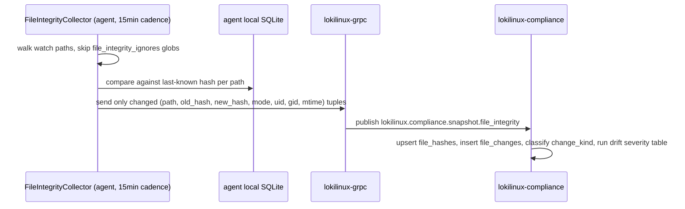

<!-- generated-by: claude -->
# Configuration Drift Detection + File Integrity Monitoring

## 1. Three-way comparison

Every ingested snapshot (per [04-PROTOCOL.md](04-PROTOCOL.md), only domains whose hash
changed trigger this) is compared three ways, exactly as the brief specifies:

```go
// services/compliance/internal/drift/detector.go
func (d *detectorImpl) DetectAll(ctx context.Context, agentID, domain string, newFacts Facts) ([]Event, error) {
	var events []Event

	if baseline, ok := d.baselineFor(ctx, agentID, domain); ok {
		if diffs := diffDocuments(baseline, newFacts); len(diffs) > 0 {
			events = append(events, d.buildEvent(domain, "BASELINE", diffs, agentID))
		}
	}
	if previous, ok := d.previousSnapshotFor(ctx, agentID, domain); ok {
		if diffs := diffDocuments(previous, newFacts); len(diffs) > 0 {
			events = append(events, d.buildEvent(domain, "PREVIOUS_SNAPSHOT", diffs, agentID))
		}
	}
	if desired, ok := d.desiredStateFor(ctx, agentID, domain); ok { // policy-driven target state, distinct from baseline
		if diffs := diffDocuments(desired, newFacts); len(diffs) > 0 {
			events = append(events, d.buildEvent(domain, "DESIRED_STATE", diffs, agentID))
		}
	}
	return events, nil
}
```

`BASELINE` = the Baseline Manager's `baseline_effective.merged_state` (what the org *decided*
this class of server should look like). `PREVIOUS_SNAPSHOT` = the last `inventory_snapshots`
row for this domain (what actually changed, regardless of whether it's compliant — catches
"someone edited sshd_config" even when the new value happens to still pass every rule).
`DESIRED_STATE` = the target state implied by an in-flight or completed remediation plan (did
the fix actually take effect, and does it still hold on the *next* snapshot after that). These
are deliberately three separate comparisons, not one merged diff — a change can be simultaneously
"matches previous baseline drift" and "not yet the desired post-remediation state," and the UI
needs to distinguish "drifted from policy" from "remediation didn't stick."

## 2. Diff algorithm

```go
// diffDocuments walks both canonical JSON documents structurally (not text-diff —
// canonical documents are deterministically key-ordered, so a structural walk is both
// cheaper and immune to whitespace/ordering false positives that a text diff would catch).
func diffDocuments(old, new_ map[string]any) []FieldDiff {
	var diffs []FieldDiff
	walk("", old, new_, &diffs)
	return diffs
}

func walk(path string, old, new_ any, out *[]FieldDiff) {
	switch nv := new_.(type) {
	case map[string]any:
		ov, _ := old.(map[string]any)
		keys := unionKeys(ov, nv)
		for _, k := range keys {
			walk(path+"/"+k, mapGet(ov, k), mapGet(nv, k), out)
		}
	default:
		if !deepEqual(old, new_) {
			*out = append(*out, FieldDiff{FieldPath: path, OldValue: old, NewValue: new_})
		}
	}
}
```

`FieldPath` uses JSON-pointer syntax (`/sshd/PermitRootLogin`) matching `drift_details.field_path`
in the schema — the same path format the frontend's diff viewer renders directly against the
two stored JSONB documents, no server-side pretty-printing needed.

## 3. Severity classification

Severity is not user-configured per event — it's derived deterministically so drift events are
consistent fleet-wide:

| Domain × change | Severity |
|---|---|
| `selinux` disabled/permissive, `firewall` rule removed, `sudo`/`pam` weakened, root login enabled | CRITICAL |
| `users`/`groups` added/removed, `auditd` rules changed, `sshd` hardening regressed, `capabilities` granted | HIGH |
| `sysctl`/`systemd_services`/`cron` changed, package added/removed outside change window | MEDIUM |
| `mounts` option changed without security implication, `time_sync`/`dns` config drift | LOW |

Table implemented as a lookup keyed by `(domain, change_type)` in
`internal/drift/severity_table.go`, overridable per policy assignment (an org can decide a
particular sysctl key is CRITICAL for them) — the table is the default, not a hardcoded ceiling.

## 4. Root cause correlation

```go
// internal/drift/rootcause.go — best-effort, never fabricated
func (r *rootCauser) Correlate(ctx context.Context, agentID string, driftTime time.Time) *RootCause {
	window := 10 * time.Minute
	if job := r.findJobTouchingAgent(ctx, agentID, driftTime, window); job != nil {
		return &RootCause{Source: "job", JobID: &job.ID}
	}
	if change := r.findPolicyOrBaselineChange(ctx, driftTime, window); change != nil {
		return &RootCause{Source: "policy_change", UserID: &change.ChangedBy}
	}
	return nil // "unknown" in the UI, not guessed
}
```

Checks, in order: (1) was there a completed `JobResult` for this agent within ±10 minutes of
the drift timestamp (a LokiLinux-initiated change explains most drift); (2) was there an
`audit_logs`/`policy_audit` entry for a baseline or policy touching this agent's scope in that
window (a deliberate policy change, not an out-of-band edit). If neither matches, `root_cause`
stays `{"source": "unknown"}` — exactly the brief's "root cause if possible," not "root cause,
guessed."

## 5. File Integrity Monitoring — hash engine

Algorithms: SHA256 (default, matches the existing package-checksum convention already used
fleet-wide), SHA512 and BLAKE3 selectable per `compliance.fim_algo` setting for orgs with a
specific compliance-framework hashing requirement (some STIG profiles mandate SHA512 for FIM).
Watched paths, exactly per the brief: `/etc`, `/usr/lib/systemd`, `/boot`, `/etc/ssh`,
`/etc/pam.d`, `/etc/security`, `/etc/audit`, `/etc/sysctl*` — configurable additions per scope
via `baseline_effective` (an APPLICATION-scope baseline can watch an app-specific config dir).



Never re-sends the full tree — only deltas, following the same discipline as domain delta-sync
(D2). "Show diff": for text-parseable files (configs under the watch list are almost always
text) the UI fetches both hash-addressed blob contents (small — config files, not arbitrary
binaries) via `inventory_blobs`-style content-addressable storage and renders a text diff
client-side; binary files show hash/metadata-only.

## 6. Ignore rules

`file_integrity_ignores` (per-scope glob patterns) are pulled down as part of the effective
baseline and applied **agent-side, before hashing** — not filtered out server-side after the
fact — so a noisy path never even generates network traffic, let alone a stored row. Matches
the brief's "ignore configurable files" requirement precisely: configurable per scope, not a
single global ignore list.
