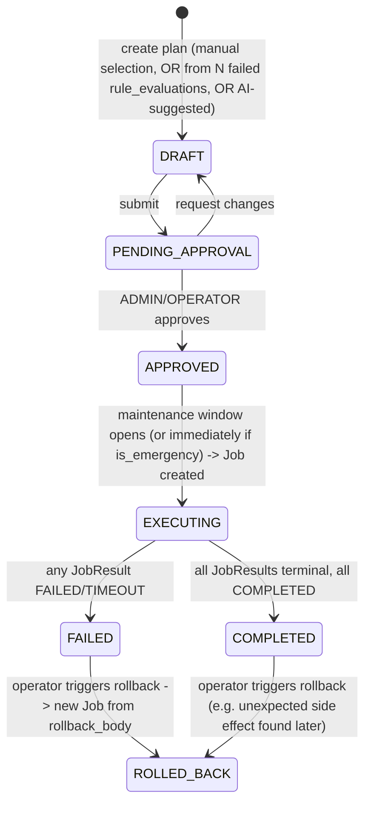

<!-- generated-by: claude -->
# Remediation Engine

## 1. Built on the existing Job Engine, not a parallel dispatch system

`JobService.create_job` (`backend/lokilinux/services/job_service.py:123`) already provides
everything remediation needs: SHA256 dedup-key idempotency, per-agent fan-out (one `JobResult`
row per target), approval gating (`requires_approval`/`approved_by`/`approved_at`), and status
aggregation (`recompute_job_status`). Building a second dispatch path in the Go service would
duplicate all of that and fragment "what jobs are running" across two systems the operator
would have to check separately. Instead:

```
remediation_plans (this module)
  └─< remediation_actions (this module) ── rendered_body per (agent, rule/drift, provider)
        └── grouped into one Job per plan via JobService.create_job(job_type="COMPLIANCE_REMEDIATE", ...)
              └─< JobResult (existing) ── one row per targeted agent, existing pull-based dispatch
remediation_jobs (this module) ── join table recording plan_id <-> job_id
```

**Depends on Phase 0** ([04-PROTOCOL.md](04-PROTOCOL.md) §2): the job→agent wire is currently
broken in three places, so `COMPLIANCE_REMEDIATE` jobs would be created and approved but never
executed until that fix ships. This document assumes the fix is in place.

## 2. Workflow



- **Manual**: operator selects specific drift events / failed rules in the UI, builds a plan.
- **Scheduled**: the Go scheduler ([02-GO-SERVICE.md](02-GO-SERVICE.md) §4) creates DRAFT plans
  automatically for policy-set violations found during a scan, gated behind approval by default.
- **Automatic**: a policy assignment can flag `auto_approve: true` for specific low-risk rule
  categories (e.g. sysctl-only fixes) — plans still go through APPROVED→EXECUTING, just without
  a human click, and are still fully audited exactly like a manual approval would be.
- **Emergency Mode**: `is_emergency=true` bypasses the maintenance-window gate (executes
  immediately once approved) but **never** bypasses approval itself — "emergency" means "skip
  the wait for 2am Saturday," not "skip human sign-off," which would defeat the entire audit
  and approval model for a fleet-wide security response.

## 3. Execution providers

| Provider | Executor (already exists) | Notes |
|---|---|---|
| Ansible | `agent/internal/modules/ansible_executor.go` | Playbook rendered from `remediation_templates.body` + policy-supplied vars, written to a temp dir with roles, run via `ansible-playbook -i localhost, -c local` — same path/argv-only invocation already used for `ANSIBLE_PLAYBOOK` jobs, no new agent code needed |
| Shell | `agent/internal/modules/job_executor.go` | `/bin/sh -c`, same pgid-kill-on-timeout behavior already implemented |
| Python | new: `agent/internal/modules/python_executor.go` | For remediation logic too structured for a one-liner shell script but not worth a full playbook; runs `python3 -c <rendered_body>` under the same timeout/pgid-kill discipline as the shell executor |
| Terraform | future | Placeholder provider slot in `remediation_actions.provider`; no agent-side executor planned until an actual infra-as-code remediation use case (e.g. security-group drift) is scoped — not built speculatively |

Every provider returns the same `modules.JobResult` shape (`job_executor.go:14-21`) the agent
already standardizes on, so `JobService`'s result-handling path needs zero provider-specific
branching.

## 4. Rollback

Each `remediation_actions` row optionally carries `rollback_body` — for Ansible, generated
from the same ComplianceAsCode content where upstream ships a `platform` remediation as a
one-directional apply (most CIS/STIG remediations don't have an upstream-authored inverse, so
`rollback_body` is frequently null and the UI marks that action "not automatically reversible,"
rather than fabricating a rollback). Where a rollback is known (e.g. a sysctl value: apply
just re-sets the old value, trivially reversible), triggering `POST
/remediation-plans/{id}/rollback` creates a **new** Job from the stored `rollback_body` values
of every completed action — rollback is itself a normal, audited, approved Job, never a direct
mutation.

## 5. Maintenance windows

`maintenance_windows` (cron expression + duration + timezone, scoped like baselines) are
evaluated by the Go scheduler's `cron.go` ([02-GO-SERVICE.md](02-GO-SERVICE.md) §4): an
`APPROVED` plan whose scope matches an open window transitions to `EXECUTING`
automatically; outside a window it waits. This is also where `Job.scheduled_time` finally gets
a real consumer — the created Job's `scheduled_time` is set to the window's next occurrence,
and the scheduler's dispatch loop is what flips it from `SCHEDULED` to `QUEUED` at the right
moment ([00-OVERVIEW.md](00-OVERVIEW.md) §6, item 1's sibling gap).

## 6. Git integration for playbooks

Remediation Ansible playbooks are stored the same way the existing `playbooks`/
`ansible_projects`/`ansible_roles` tables already integrate with git — `remediation_templates.git_path`
points into the same git-backed playbook store `PlaybookEditor.vue` already edits, so a
promoted (org-customized, no longer just the upstream ComplianceAsCode default) remediation
template is a normal versioned playbook indistinguishable from any other in the existing
Ansible Automation Integration UI, not a second parallel playbook system.

## 7. Approval enforcement, exactly matching the existing job-approval pattern

```python
# routers/compliance/remediation.py — mirrors routers/jobs.py:172 exactly
@router.post("/remediation-plans/{plan_id}/approve")
async def approve_remediation_plan(
    plan_id: UUID,
    db: AsyncSession = Depends(get_db),
    nats=Depends(get_nats),
    current_user: dict = Depends(require_role("ADMIN", "OPERATOR")),
) -> RemediationPlanResponse:
    plan = await RemediationService(db).approve(plan_id, approved_by=current_user["id"])
    job = await JobService(db, cache, nats).create_job(
        job_type="COMPLIANCE_REMEDIATE",
        target_servers={"agent_ids": [a.agent_id for a in plan.actions]},
        parameters={"remediation_plan_id": str(plan_id)},
        requires_approval=False,  # already approved at the plan level — no double-approval
        policy_id=None,
    )
    await AuditService(db).log(
        action="compliance.remediation_approved", user_id=current_user["id"],
        resource_type="remediation_plan", resource_id=str(plan_id),
    )
    return RemediationPlanResponse.model_validate(plan)
```
