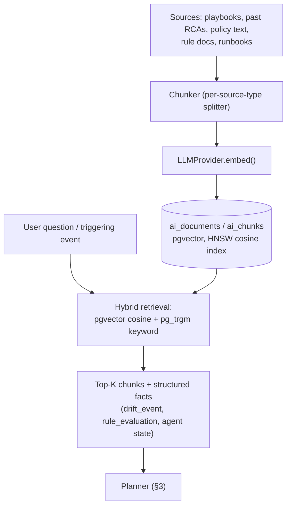

<!-- generated-by: claude -->
# AI Compliance Assistant

## 1. Provider-agnostic by decision, not by default hedging

No LLM dependency exists anywhere in the backend today (`backend/pyproject.toml` has neither
`anthropic` nor `openai`; confirmed by grep for `anthropic|openai|llm|embedding|pgvector` across
`backend/lokilinux/`). Since nothing is locked in, and LokiLinux is marketed at
compliance-conscious enterprises — exactly the customer segment most likely to require
on-prem/air-gapped inference for regulatory reasons — the assistant is built against a provider
abstraction from day one rather than hardwiring a single vendor SDK.

```python
# backend/lokilinux/ai/providers/base.py
from abc import ABC, abstractmethod

class LLMProvider(ABC):
    @abstractmethod
    async def complete(self, messages: list[dict], tools: list[dict] | None = None) -> Completion: ...

    @abstractmethod
    async def embed(self, texts: list[str]) -> list[list[float]]: ...


# backend/lokilinux/ai/providers/anthropic_provider.py
class AnthropicProvider(LLMProvider):
    """Default provider. Model id configurable via ai.model_name (e.g. claude-opus-5,
    claude-sonnet-5) — never hardcoded, since model ids change over the product's lifetime."""

# backend/lokilinux/ai/providers/openai_provider.py    — hosted alternative
# backend/lokilinux/ai/providers/ollama_provider.py     — on-prem / air-gapped
# backend/lokilinux/ai/providers/vllm_provider.py       — on-prem, higher-throughput self-hosted
```

Selected via `settings_schema.py` (new `ai` group, following the existing flat
`"{group}.{key}"` convention):

```python
# backend/lokilinux/settings_schema.py — addition
"ai": {
    "provider": ("string", "anthropic"),       # anthropic / openai / ollama / vllm
    "model_name": ("string", "claude-opus-5"),
    "api_key": ("string", ""),                  # encrypted at rest, same treatment as ldap_bind_password
    "base_url": ("string", ""),                 # required for ollama/vllm, ignored for hosted providers
    "embedding_model": ("string", "text-embedding-3-small"),
    "embedding_dimension": ("integer", 1536),
    "max_planner_steps": ("integer", 6),
},
```

## 2. RAG architecture



`pgvector` (`CREATE EXTENSION vector`, [01-DATA-MODEL.md](01-DATA-MODEL.md) §1) is the first
new Postgres extension since `timescaledb` — chosen over a separate vector database because the
platform already runs one Postgres cluster for everything, and a fleet's RAG corpus (playbooks,
RCAs, rule docs) is small enough (thousands, not billions, of chunks) that a dedicated vector DB
would be pure operational overhead. `ai_chunks.embedding` dimension is provider-configurable
(`ai.embedding_dimension`), not hardcoded to one vendor's output size.

Retrieval is hybrid: `pgvector`'s HNSW cosine index for semantic similarity, combined with the
existing `pg_trgm` extension (already installed, `migration 001`) for exact-term matching (a
CVE ID or exact rule key in the question should always surface its source document, which pure
semantic search can miss).

## 3. Planner and Tool API — read-only by construction

```python
# backend/lokilinux/ai/planner.py
class CompliancePlanner:
    """Bounded tool-calling loop, max_planner_steps from settings. Every tool is either
    read-only (executes immediately) or mutation-shaped (always returns a PROPOSAL, never
    executes) — this split is enforced by the Tool API itself, not by prompting."""

    def __init__(self, provider: LLMProvider, tools: ToolRegistry): ...

    async def run(self, question: str, context: RagContext) -> AiRecommendation: ...
```

```python
# backend/lokilinux/ai/tools.py — the entire surface the model can call
READ_TOOLS = [
    "get_agent_inventory",       # -> InventoryService.get_snapshot
    "get_drift_events",          # -> DriftService.list
    "get_rule_evaluations",      # -> PolicyEngineService.evaluations_for
    "get_baseline_effective",    # -> BaselineService.resolve
    "get_job_history",           # -> JobService.list (existing)
    "get_audit_trail",           # -> AuditService.query (existing table)
    "search_playbooks",          # -> existing playbooks table
    "get_cve_data",              # -> existing CVEService — reuse, don't re-fetch NVD
    "get_metrics",                # -> existing agent_metrics hypertable
]

# Mutation-shaped capabilities never execute directly — each maps to a *proposal* writer:
PROPOSAL_TOOLS = {
    "propose_remediation_plan": "writes ai_recommendations(kind=REMEDIATION_PLAN, status=PROPOSED)",
    "propose_playbook":         "writes ai_recommendations(kind=PLAYBOOK, status=PROPOSED)",
    "propose_change_request":   "writes ai_recommendations(kind=CHANGE_REQUEST, status=PROPOSED)",
}
```

There is no code path from an LLM response to a `JobService.create_job` call, an Ansible
execution, or a database mutation of platform state — the *only* thing a "propose_*" tool call
can do is insert a row into `ai_recommendations` with `status='PROPOSED'`. Turning a proposal
into a real `remediation_plan` (and from there, a real Job) requires the existing human-approval
endpoint (`POST /ai/recommendations/{id}/approve`, [05-API.md](05-API.md) §6,
`require_role("ADMIN", "OPERATOR")`) — architecturally identical to how a baseline or policy
change requires approval, so "AI never executes destructive actions without approval" isn't a
prompt instruction that can be argued around, it's the absence of any executing code path.

## 4. Capabilities mapped to brief requirements

| Brief capability | Implementation |
|---|---|
| Explain drift | `subject_type=drift_event` question → RAG over that event's `drift_details` + root cause + similar past events → `kind=EXPLAIN_DRIFT` |
| Explain compliance failure | `subject_type=rule_evaluation` → rule's rationale/description (already imported from ComplianceAsCode, §07-POLICY-ENGINE.md) + actual vs expected value |
| Estimate risk | Combines rule severity, CVE correlation (`get_cve_data` tool), and fleet blast radius (`count(*)` of other agents with the same failing rule) into a structured risk score, not a bare LLM guess |
| Generate remediation / Ansible / Bash / Terraform | `propose_remediation_plan`/`propose_playbook`, seeded with the rule's existing `remediation_templates` entry as a starting point rather than generating from scratch — reduces hallucination risk for security-sensitive scripts |
| Generate documentation / RCA / Change Request | `kind=DOC`/`RCA`/`CHANGE_REQUEST`, RAG-grounded in the actual drift/audit history, not free invention |
| Answer infrastructure questions | `POST /ai/ask`, general RAG + read-only tools |

## 5. Guardrails

- **Tool-call boundary** (§3) — the primary guardrail, not a secondary one.
- **Bounded planner loop** — `ai.max_planner_steps` hard-caps tool-call iterations; a runaway
  or confused planning loop terminates with a partial answer rather than looping indefinitely.
- **Every recommendation is fully attributable** — `ai_recommendations.prompt_context` stores
  exactly what the planner was given, `model_provider`/`model_name` record what generated it,
  so a bad recommendation is reproducible and auditable, not a black box.
- **No secrets in context** — RAG retrieval never includes `settings` rows flagged sensitive
  (LDAP bind password, API keys) or raw `/etc/shadow` contents; the Tool API's read scope is
  built from the same service-layer methods the REST API uses, which already never expose those.
- **Rate/cost control** — reuses the platform's existing rate-limit middleware
  (`backend/lokilinux/middleware/rate_limit.py`) on `/ai/ask`, plus a per-org monthly token
  budget setting (`ai.monthly_token_budget`) enforced before the first provider call, not after.
