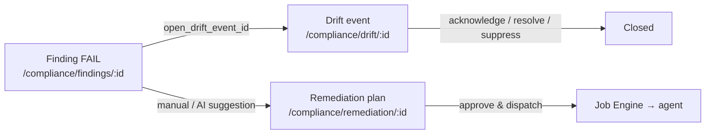

<!-- generated-by: claude -->
# Compliance Frontend — Page Reference

Per-page reference for the compliance module UI: what each page answers, what is on it,
which API endpoints it calls, which actions are gated how, and how the pages link into each
other. Design rationale and stack decisions live in [11-FRONTEND.md](11-FRONTEND.md); this
document is the operator-facing page map, confirmed by exploration of the live source
(`frontend/pages/compliance/**`, `frontend/stores/compliance.ts`, `layouts/default.vue`,
`backend/lokilinux/api/v1/routers/compliance/*`).

## 0. Conventions used on every page

- **Auth gating (UI)**: `useCurrentUser()` → `canEdit` = ADMIN or OPERATOR,
  `isAdmin` = ADMIN (`frontend/composables/useAuth.ts:58`). Buttons are hidden, not
  disabled, when the role lacks the right.
- **Auth gating (API)**: reads are `get_current_user` (any authenticated user); mutations
  are `require_role(...)` (baselines, drift, assessments, reports) or the finer-grained
  `require_permission("compliance.<area>.<verb>")` (findings, exceptions, policy engine,
  remediation). The UI role check is a convenience mirror — the backend is the authority.
- **Pagination**: all list endpoints return `CursorPage[T]` (`{items, next_cursor, total}`).
  Pages render 25 rows and a "Load more" button; the store's shared `fetchCursorPage`
  helper appends or replaces.
- **Store**: one Pinia setup store, `stores/compliance.ts`, wraps every endpoint below.
  Pages never call `useApi()` for compliance data directly (two deliberate one-off
  exceptions are flagged inline).
- **Tables**: `DataTable` sortable, page-size 25, row-click navigates where noted.
- **Toasts/dialogs**: create/lifecycle errors surface as toasts; create forms live in
  `Dialog` overlays; destructive or dispatch actions use `confirm()`.

## 1. Navigation map

From the `navSections` computed in `layouts/default.vue`: a single `Compliance` section
(four top-level rows + one group), replacing the earlier split between a `Configuration`
section and a `Compliance` section — both lived under `/compliance/*` regardless, so the
merge is nav-only, no route or engine changes.

| Menu label | Route | Page file | Group |
|---|---|---|---|
| Overview | `/compliance` | `index.vue` | top level |
| Findings | `/compliance/findings` | `findings/index.vue` | top level |
| Drift | `/compliance/drift` | `drift/index.vue` | top level |
| File Integrity | `/compliance/file-integrity` | `file-integrity/index.vue` | top level |
| Standards | `/compliance/standards` | `standards/index.vue` | Catalog ▸ |
| Rule Catalog | `/compliance/rules` | `rules/index.vue` | Catalog ▸ |
| Policy Sets | `/compliance/policies` | `policies/index.vue` | Catalog ▸ |
| Baselines | `/compliance/baselines` | `baselines/index.vue` | Catalog ▸ |
| Remediation | `/compliance/remediation` | `remediation/index.vue` | Catalog ▸ |
| Exceptions | `/compliance/exceptions` | `exceptions/index.vue` | Catalog ▸ |
| Reports | `/compliance/reports` | `reports/index.vue` | Catalog ▸ |

Detail pages (`baselines/[id].vue`, `drift/[id].vue`, `findings/[id].vue`,
`policies/[id].vue`, `remediation/[id].vue`, `rules/[id].vue`,
`standards/[key]/[version].vue`) are reached by row-click / links, not from the menu.
Route protection is global (`middleware/auth.global.ts`) — no `definePageMeta` anywhere.

## 2. Shared infrastructure

### 2.1 `stores/compliance.ts` — state blocks, actions, endpoints

| Domain | Key state | Actions → endpoints |
|---|---|---|
| Dashboard widgets | `overview`, `trend`, `trendRange`, `topViolations`, `topChangedFiles`, `assessments` | `fetchOverview` → GET `/compliance/overview`; `fetchTrend` → GET `/compliance/trend?range=`; `fetchTopViolations` → GET `/compliance/dashboard/top-violations`; `fetchTopChangedFiles` → GET `/compliance/dashboard/top-changed-files`; `fetchAssessments` → GET `/compliance/assessments?limit=5`; `createAssessment` → POST `/compliance/assessments` |
| Baselines | `baselines*`, `baselineFilters{scope_type}`, `selectedBaseline`, `versions*` | `fetchBaselines` → GET `/compliance/baselines?scope_type=`; `createBaseline` → POST; `fetchBaseline` → GET `/{id}`; `fetchVersions` → GET `/{id}/versions`; `createVersion` → POST `/{id}/versions`; `submitVersion`/`approveVersion`/`publishVersion`/`rollbackVersion` → POST `/{id}/versions/{vid}/submit\|approve\|publish\|rollback` |
| Rules | `rules*`, `ruleFilters{domain,check_source,severity,search,framework,platform,status,rule_status}`, `selectedRule` | `fetchRules` → GET `/compliance/rules` (8 filter params); `fetchRule` → GET `/compliance/rules/{id}` (detail incl. `framework_mappings`, `coverage`, `failing_agents`) |
| Policy sets | `policySets*`, `selectedPolicySet`, `policySetRules`, `policySetCoverage` | `fetchPolicySets` → GET `/compliance/policy-sets`; `createPolicySet` → POST; `fetchPolicySet` → GET `/{id}`; `fetchPolicySetRules` → GET `/{id}/rules`; `addPolicySetRule` → POST `/{id}/rules`; `fetchPolicySetCoverage` → GET `/{id}/coverage`; `importPolicySet` → POST `/compliance/policy-sets/import` (202 `{job_id,status}`); `publishPolicySet`/`archivePolicySet` → POST `/{id}/publish\|archive`; `newPolicySetVersion` → POST `/{id}/new-version`; `setPolicySetRemediation` → PATCH `/{id}/remediation`; `createPolicyAssignment` → POST `/compliance/policy-assignments` |
| Drift | `driftEvents*`, `driftFilters{severity,domain,acknowledged,status}`, `selectedDriftEvent`, `driftDetails` | `fetchDriftEvents` → GET `/compliance/drift-events`; `fetchDriftEvent` → GET `/{id}`; `fetchDriftDetails` → GET `/{id}/details`; `acknowledgeDrift`/`suppressDrift(reason)`/`resolveDrift` → POST `/{id}/acknowledge\|suppress\|resolve` |
| Findings | `findings*`, `findingFilters{severity,domain,agent_id,result(=FAIL)}`, `selectedFinding` | `fetchFindings` → GET `/compliance/findings`; `fetchFinding` → GET `/{id}` (detail incl. expected/actual, `evidence` + `evidence_hash`, snapshot, `open_drift_event_id`); `acknowledgeFinding` → POST `/{id}/acknowledge` |
| Standards | `standards*`, `selectedStandard` | `fetchStandards` → GET `/compliance/standards`; `fetchStandard(key, version)` → GET `/compliance/standards/{key}/{version}` |
| Exceptions | `exceptions*`, `exceptionFilters{status}` | `fetchExceptions` → GET `/compliance/exceptions`; `createException` → POST (then refetch — create response lacks joins); `approveException`/`revokeException` → POST `/{id}/approve\|revoke` |
| Remediation | `remediationPlans*`, `remediationFilters{status}`, `selectedRemediationPlan`, `remediationActions`, `remediationExecution`, `maintenanceWindows` | `fetchRemediationPlans` → GET `/compliance/remediation-plans`; `fetchRemediationPlan` → GET `/{id}`; `fetchRemediationActions` → GET `/{id}/actions`; `createRemediationPlan` → POST; `submitRemediationPlan`/`approveRemediationPlan` → POST `/{id}/submit\|approve`; `dryRunRemediationPlan` → POST `/{id}/dry-run`; `fetchRemediationExecution` → GET `/{id}/execution`; `rollbackRemediationPlan` → POST `/{id}/rollback`; `fetchMaintenanceWindows` → GET `/compliance/maintenance-windows`; `createMaintenanceWindow` → POST |
| File integrity | `fileHashes*`, `fileChanges*`, `fileChangeFilters{agent_id,change_kind}`, `fileChangePathDetail` | `fetchFileHashes(agentId)` → GET `/compliance/agents/{agentId}/file-hashes?path_prefix=`; `fetchFileChanges` → GET `/compliance/file-changes`; `fetchFileChangesByPath(path)` → GET `/compliance/file-changes/by-path?path=` |
| Reports | `reports*` | `fetchReports` → GET `/compliance/reports`; `createReport` → POST (types + params, see §3.11) |

Store-only helpers: `applyDriftUpdate` / `applyExceptionUpdate` patch rows in place while
preserving join fields (`hostname`, `rule_key`) that the response models don't carry.

### 2.2 `components/compliance/TrendChart.vue`

Unovis `VisArea` (`@unovis/vue`, `CurveType.Natural`) — filled area (opacity 0.12) + 2px
line, `var(--chart-1)`, height 96, wrapped in the app's `ChartContainer`/`ChartTooltip`
(formatter `v.toFixed(1)%`). Props: `points: TrendPoint[]` (`{day, compliance_pct}`),
`loading`, `range` (emits `update:range` — 7d/30d/90d/1y toggle). Header shows the latest
value; "Not enough history yet" empty state under 2 points; Skeleton while loading.
Auto-imported as `<ComplianceTrendChart>`.

---

## 3. Page reference

### 3.1 `/compliance` — fleet dashboard (`index.vue`)

**Purpose.** "How compliant are we today?" — one weighted fleet number plus the
operational KPIs, trend, and triage shortcuts.

**UI.**
- Hero card "Fleet compliance (weighted)" (source: GET `/compliance/fleet-compliance`,
  60s-cached endpoint): big `weighted_score` %, open findings split C/H/M/L, open drift,
  scored agents 24h/active, and an amber "Unknown basis" counter — agents with no score
  are explicitly *not* counted as compliant. Per-category weighted bars.
  "Standards coverage (CEL-executable / total)" progress cards.
- 9 `MetricCard` KPIs: Compliance %, Critical violations, High violations, Baselines
  (active), Policies (published+enabled), Open drift, Servers evaluated, Non-compliant,
  Exceptions (active). Each links to its page.
- `<ComplianceTrendChart>` with range switcher.
- "Top violations": two tables — top-5 failing rules, top-5 recent drift (rows clickable).
- "Top changed files" (top 8; click → File Integrity deep-link `?path=`).
- "Recent baselines" (top 5, clickable), "Recent assessments" (progress:
  `servers_done/servers_total`, `rules_done/rules_total`).
- Dialog "Run assessment": policy set `Select` + scope selector JSON textarea.

**API.** `/compliance/fleet-compliance` (direct `useAsyncData`), plus store:
overview, trend, top-violations, top-changed-files, baselines, assessments, policy-sets.

**Actions.** Refresh (hero); "Run assessment" → POST `/compliance/assessments`
(202; UI `canEdit`, API `require_role("ADMIN","OPERATOR")`).

**Links.** KPI cards → rules/drift/baselines/policies/exceptions/servers; "View all" →
drift, file-integrity, baselines; rows → drift detail, file-integrity `?path=`, baseline
detail.

### 3.2 `/compliance/baselines` (+ `[id]`) — Baseline Manager

**Purpose.** The *desired* configuration state, scoped as a tree
(GLOBAL → OS → ROLE → ENVIRONMENT → DATACENTER → CLUSTER → APPLICATION,
most-specific-wins merge — see [06-BASELINE.md](06-BASELINE.md)).

**List.** Scope-type `Select` filter, count badge, Refresh, "New baseline" (`canEdit`).
Columns: Name, Scope, Selector, Status, Created. Create dialog: name, description,
scope_type, JSON scope selector, JSON expected_state ("version 1").

**Detail.** `AppTabs` **Versions / Details**.
- Versions tab: one card per version (vN, change summary, `content_hash` prefix, status
  badge) with the state-machine buttons:
  - **Submit** — `canEdit` + DRAFT
  - **Approve** — `isAdmin` + PENDING_APPROVAL
  - **Publish** — `isAdmin` + APPROVED
  - **Roll back to this** — `isAdmin` + DEPRECATED
- Details tab: scope selector JSON, enabled, created/updated.
- Dialog "New draft version": change summary + expected-state JSON.

**API.** `/compliance/baselines` CRUD + `/versions[/{vid}/submit|approve|publish|rollback]`.
API-side: create/submit = `require_role("ADMIN","OPERATOR")`; approve/publish/rollback =
`require_role("ADMIN")` (`baselines.py:73-174`). Versions are immutable and Ed25519-signed
on publish; rollback re-publishes an old version rather than mutating history.

**Links.** Back to list; row-click → detail.

### 3.3 `/compliance/drift` (+ `[id]`) — Drift triage

**Purpose.** Config deviated from the published baseline — triage, then fix or waive.

**List.** Filters: Severity, Domain, Status (All/Open/Acknowledged/Resolved/Suppressed).
Columns: Detected, Server, Domain, Severity, Occurrences (`N×` — repeats collapse into
one row), Status, actions. Inline actions (`canEdit`, API
`require_role("ADMIN","OPERATOR")`, `drift.py:146-213`): **Acknowledge** (OPEN),
**Resolve** (OPEN/ACKNOWLEDGED), **Suppress**.

**Detail.** Header badges (Severity, Status) + lifecycle buttons (same gating).
Metadata grid: Compared against (BASELINE / PREVIOUS_SNAPSHOT / DESIRED_STATE), change
type, occurrences, first/last seen, resolved at. **Field-level diff**: one card per
detail row — mono `field_path` (JSON pointer), `- old_value` (destructive) vs
`+ new_value` (success) JSON blocks.

**API.** `/compliance/drift-events[/{id}][/details|acknowledge|suppress|resolve]`.

**Links.** From dashboard Top-violations; from Finding detail via
`open_drift_event_id` (§3.6); back → list.

### 3.4 `/compliance/file-integrity` — FIM browser + scope config

**Purpose.** File integrity monitoring: per-server watched-file hash state, the
fleet-wide change history with per-path forensics, and — third tab — what the agent's
FIM collector actually scans, globally and per server.

**UI.** `AppTabs` **Current State / Change History / Watched paths**:
- *Current State*: server `Select` (from `serversStore.fetchAgentsForSelect()`, first
  agent auto-selected), path-prefix input (e.g. `/etc/ssh`), "N watched files" badge.
  Columns: Path, Hash (16-char prefix), Size, Last seen.
- *Change History*: change-kind filter (CREATED/MODIFIED/DELETED/PERMISSION_CHANGED/
  OWNER_CHANGED). Columns: Time, Server, Path (button), Change (colored badge), Details
  (PERMISSION_CHANGED → `644 → 600`; OWNER_CHANGED → `uid:gid → uid:gid`).
- Path detail dialog (opened by path click **or** `?path=` deep-link from the dashboard):
  "Servers" (hosts with changes), "Related rules" (badge links), "Related open drift"
  (summary + severity), "Timeline".
- *Watched paths*: **Global default** card — two `Textarea` (watch/ignore, one path per
  line), `canEdit`-gated Save; read-only for viewers/auditors. **Per-server overrides**
  card — list of agents with an `AGENT`-scope row (hostname, watch/ignore paths,
  Edit/Reset), "Add override" dialog picks a server not already overridden. Watch-paths
  list cannot be empty (server rejects it — an empty override falls back to the compiled
  `/etc` default on the agent, so an "override" with nothing in it would silently be a
  no-op wearing an override label; use Reset instead). Applies to agents ≥ 0.41.0
  (`MIN_AGENT_VERSION_FIM_SCOPES`); older agents keep scanning the compiled default.

**API.** `/compliance/agents/{agentId}/file-hashes?path_prefix=`,
`/compliance/file-changes?agent_id=&change_kind=` (agent_id exists in the store but the
page currently wires only change_kind), `/compliance/file-changes/by-path?path=`,
`/compliance/fim-scopes` (GET, PUT global, PUT/DELETE `/{agent_id}` — §5).

**Links.** Related-rule badges → `/compliance/rules/{id}`; receives `?path=` from the
dashboard.

### 3.5 `/compliance/standards` (+ `[key]/[version]`) — framework catalog (read-only)

**Purpose.** Every framework version the catalog knows, with *honest* executable-vs-
reference coverage — not an assumed 100%.

**List.** Columns: Standard (name + publisher), Version, Rules, Executable,
Reference-only, Coverage (badge: ≥75% green, ≥25% amber, else red). Custom empty text
points at the ComplianceAsCode import / curated packs.

**Detail.** One card per **control**: mono `control_id`, title, "N rule(s)" badge, rule
rows (title link + Severity + check_source badges) or "No rule mapped to this control
yet." Fully read-only.

**API.** `/compliance/standards`, `/compliance/standards/{key}/{version}`.

**Links.** Rule titles → `/compliance/rules/{id}`; back → list.

### 3.6 `/compliance/findings` (+ `[id]`) — evaluation triage

**Purpose.** Fleet-wide rule-evaluation results (read-model projection over
`rule_evaluations`; the `id` is an opaque server-encoded key, `findings.py:55`), default
view = FAIL only.

**List.** Filters: Severity, Domain, Result (Failing=FAIL default / Unknown / All).
Columns: Last seen, Server, Rule (title + mono `rule_key`), Domain, Severity, Result,
actions. Inline **Acknowledge** (`canEdit`; API
`require_permission("compliance.findings.acknowledge")`, `findings.py:249`; only when
`!acknowledged_at`).

**Detail.** Header badges Severity + Result; grid: rule, source, acknowledged-by, active
exception ("Covered by an active exception" when `exception_id`), snapshot `taken_at`,
error (destructive). Two side-by-side JSON cards **Expected / Observed**. **Evidence**
card with the raw fact snippet + `blake3: {evidence_hash}` (tamper-evident).
Header actions: **Acknowledge** (`canEdit`), **View configuration drift** (only when
`open_drift_event_id` — the bridge to Drift detail).

**API.** `/compliance/findings[/{id}][/acknowledge]`.

**Links.** Drift detail; back → list.

### 3.7 `/compliance/policies` (+ `[id]`) — Policy Sets

**Purpose.** Rule packages that apply to scopes — CIS/STIG/NIST/PCI bundles, built
manually, via wizard, or imported from ComplianceAsCode.

**List.** Three creation entry points: **Import from ComplianceAsCode** (`isAdmin`; API
`require_permission("compliance.policies.manage")` — dialog: datastream URL (XCCDF 1.2),
content version (stored as `compliance_rules.source_version`), optional profile ID;
toast surfaces the background `job_id`), **New policy set** (`canEdit` — name, slug,
framework Select, version, description), **New via wizard** (`ComplianceWizard`,
emits `saved` → refetch). Columns: Name (slug subtitle), Framework, Version, Status,
Created.

**Detail.** Lineage line when `parent_policy_set_id` ("New version of a previously
published set"). `AppTabs`:
- **Rules**: columns Rule, Domain, Severity, Coverage (CEL badge). Amber alert when the
  set is empty — "has no rules and cannot be published", with a link back to the list.
- **Coverage**: 3 stat cards — CEL-mapped (evaluable), Unmapped, Coverage %.
- **Remediation**: mode Select **MONITOR / ASSISTED / AUTOMATIC** (ASSISTED matches a
  NULL backend value); at AUTOMATIC: Allowed/Forbidden domains `MultiSelect` (options =
  the set's distinct rule domains) + amber alert listing the extra safety gates
  (platform kill-switch in Settings → Compliance, template with rollback, open
  maintenance window). Save (`canEdit`).

Lifecycle: **Publish** (`canEdit` + DRAFT), **New version** (`canEdit` + PUBLISHED →
clones via `new-version` and navigates), **Archive** (`isAdmin` + PUBLISHED, `confirm()`;
API `compliance.policies.archive`).

**API.** `/compliance/policy-sets[/{id}][/rules|coverage|publish|archive|new-version|remediation]`,
`/policy-sets/import` (202), `/policy-assignments` (create; list endpoint exists for
API consumers, the UI creates inline from the wizard/detail flows).

### 3.8 `/compliance/rules` (+ `[id]`) — Rule Catalog (read-only)

**Purpose.** The global rule catalog (ComplianceAsCode imports + internal rules); which
checks are CEL-executable and which are reference-only.

**List.** Eight filters: search (rule ID, title, CCE/NIST/STIG/CIS refs), domain,
Coverage (CEL / OVAL_UNMAPPED / OSCAP_FALLBACK), Severity, Framework, Platform,
Status (enabled/disabled), Lifecycle (ACTIVE/DISABLED/REFERENCE_ONLY/DEPRECATED).
Columns: Rule (title + lifecycle badge + mono `rule_key`), Domain, Severity, Coverage,
Source.

**Detail.** Badges Severity + check_source + Status. Amber notice for non-CEL rules:
"Imported as reference catalog — not executable … never counts toward coverage until a
CEL check is hand-mapped." Cards: Description/Rationale; Applicability & check (platform
badges, `source · source_version`, the CEL `check_expr` pre, `expected_value` JSON);
**Framework mappings** (`framework version` + control title + `control_id` badge);
**Coverage** (PASS green / FAIL,ERROR red counts) + **Failing servers (N)** — first 20
as links to `/servers/{agent_id}`.

**API.** `/compliance/rules` (8 filter params), `/compliance/rules/{id}`
(`RuleDetailResponse`). Zero mutations.

### 3.9 `/compliance/remediation` (+ `[id]`) — Remediation Engine

**Purpose.** Author per-server script actions (with rollback), schedule maintenance
windows, and drive plans through approval into real Job Engine dispatch.

**List.** Status filter (7 states), Refresh, "Maintenance windows" + "New plan" (both
`canEdit`), red alert when the store reports an endpoint failure. Columns: Plan, Status,
Trigger, Emergency (red badge), Created. Dialogs:
- *New remediation plan*: name; Emergency checkbox (bypasses the maintenance-window
  gate, not approval); maintenance-window Select; dynamic actions list — per action:
  Provider (shell/ansible/python), Server, script body (required), rollback body
  (optional). `canSubmitCreate` = name + ≥1 complete action. Success → navigate to detail.
- *New maintenance window*: name, scope type + selector JSON, cron expression,
  duration (1–1440 min), timezone, enabled. API:
  `compliance.remediation.maintenance_windows.manage`.

**Detail.** State-machine header actions:
- **Dry run** — `canEdit` + DRAFT/PENDING_APPROVAL/APPROVED; API
  `compliance.remediation.execute` (`remediation.py:200`); runs each action's real check
  mode (ansible `--check --diff`, `sh -n`, Python `ast.parse`), 202, plan status
  untouched.
- **Submit for approval** — `canEdit` + DRAFT (`compliance.remediation.execute`).
- **Approve & dispatch** — `canEdit` + PENDING_APPROVAL; API
  `compliance.remediation.approve` (`remediation.py:217`).
- **Rollback** (amber) — `isAdmin` && COMPLETED/FAILED && ≥1 action has `rollback_body`,
  `confirm()`; API `compliance.remediation.rollback` (`remediation.py:294`).

Execution panel (when `remediationExecution.job_id`): job status badge, operation
(APPLY/ROLLBACK/DRY_RUN), job id prefix, per-agent result blocks — status badge, hostname,
`exit N`, duration, stdout (green, scrollable) / stderr (red), error message. Actions
table: #, Server, Provider, Action (rendered body), Rollback.

**API.** `/compliance/remediation-plans[/{id}][/actions|execution|dry-run|submit|approve|rollback]`,
`/compliance/maintenance-windows`.

### 3.10 `/compliance/exceptions` — waivers

**Purpose.** Time-boxed compliance waivers (rule × server/scope): "rule X fails on
server Y until date Z, by decision of an approver."

**UI.** Status filter (Pending/Active/Expired/Revoked). Columns: Rule (`rule_key`/id),
Server (hostname or "All servers"), Owner, Reason, Status, Expires, actions.
**Approve** (`isAdmin` UI; API `compliance.exceptions.approve`, only PENDING),
**Revoke** (`canEdit` UI; API `compliance.exceptions.revoke`, PENDING/ACTIVE).
Create dialog (`canEdit`; API `compliance.exceptions.create`): Rule `Select` (one-off
`GET /compliance/rules?limit=100` — carries a `ponytail:` comment: the 100-rule cap will
truncate under ComplianceAsCode imports; upgrade path = debounced `?search=`), Server
('' = scope-wide), Reason, Owner, Expires. Toast: "Pending approval before it waives
anything" — a request waives nothing until an admin approves. Rows are not clickable.

**API.** `/compliance/exceptions[/{id}/approve|revoke]`, plus the one-off rules/servers
lookups.

### 3.11 `/compliance/reports` — reporting engine

**Purpose.** Async compliance reports for audit/management + artifact download.

**UI.** Columns: Type, Format, Status, Requested, Download (COMPLETED only; FAILED shows
`error_message`). Status is polled manually via Refresh. Generate dialog (`canEdit`; API
`require_role("ADMIN","OPERATOR")`):
- Types: FLEET_SUMMARY, POLICY_SET, DATACENTER, CUSTOM, FRAMEWORK, EXCEPTION,
  EXECUTIVE_SUMMARY (`schemas/compliance_report.py:14`).
- Conditional fields: Framework input (FRAMEWORK, e.g. "cis, nist, stig"), Policy-set
  `Select` (POLICY_SET, one-off `GET /compliance/policy-sets?limit=100` — deliberate,
  not store state).
- Formats JSON/CSV/XLSX/PDF, filtered by `GET /compliance/reports/formats` — XLSX/PDF
  gated by the `reports.xlsx_pdf_enabled` settings key (help text: "XLSX/PDF disabled by
  an administrator (Settings → Reporting)").
- Download: `GET /compliance/reports/{id}/download` as blob → object URL → synthetic
  anchor `compliance-report-{id}.{format}`.

**API.** POST `/compliance/reports` (202, body `{report_type, format, params}`), GET
`/compliance/reports`, `/reports/formats`, `/reports/{id}/download`.

---

## 4. Cross-cutting flows

### F1 — Finding → Drift → Remediation (the triage chain)



Findings are the read-model of CEL evaluation; a failing check with config consequences
gets an associated `open_drift_event_id`. Drift is triaged in place; lasting fixes go
through a remediation plan (F4).

### F2 — Baseline version lifecycle

```
DRAFT ──Submit(canEdit)──► PENDING_APPROVAL ──Approve(isAdmin)──► APPROVED
APPROVED ──Publish(isAdmin, Ed25519 sign)──► PUBLISHED ──superseded──► DEPRECATED
DEPRECATED ──"Roll back to this"(isAdmin)──► re-PUBLISHED old version
```

Publish recomputes `baseline_effective` for affected agents (Go service) and emits
`lokilinux.compliance.baseline.published` ([06-BASELINE.md](06-BASELINE.md)).

### F3 — Policy set: import → publish → assignment → score

```
Import (202, background job) → rules land as CEL / OVAL_UNMAPPED
→ Publish (blocked while the set has zero rules)
→ Policy assignment (scope selector) → Go service evaluates per snapshot
→ rule_evaluations + compliance_scores → Findings / dashboard
```

### F4 — Remediation plan pipeline

```
DRAFT ──Submit──► PENDING_APPROVAL ──Approve──► dispatch (Job Engine)
   └─ Dry run (any pre-dispatch state; check-mode only, status untouched)
COMPLETED / FAILED ──Rollback(isAdmin, has rollback_body)──► ROLLED_BACK
```

Extra gates for AUTOMATIC policy remediation: platform kill-switch, rollback-capable
template, open maintenance window ([07-POLICY-ENGINE.md](07-POLICY-ENGINE.md),
[09-REMEDIATION.md](09-REMEDIATION.md)).

### F5 — Exception lifecycle

```
Request (canEdit) ──► PENDING ──Approve(isAdmin)──► ACTIVE (waives matching findings)
ACTIVE ──Revoke / expiry──► REVOKED / EXPIRED
```

### F6 — File change forensics

Dashboard "Top changed files" → `/compliance/file-integrity?path=…` → path dialog →
related rules (`/compliance/rules/:id`) and related open drift (`/compliance/drift/:id`).

## 5. API schema quick reference

Endpoint groups (all under `/api/v1/compliance`, JWT Bearer; reads =
`get_current_user`, mutations = `require_role`/`require_permission` as listed):

| Group | Endpoints (verb path → notes) | Mutation auth |
|---|---|---|
| Dashboard/overview | GET `/fleet-compliance`; GET `/overview`; GET `/trend?range=7d\|30d\|90d\|1y`; GET `/dashboard/top-violations?limit=`; GET `/dashboard/top-changed-files?limit=` | — (`overview.py:128` requires OPERATOR or AUDITOR) |
| Assessments | POST `/assessments` 202; GET `/assessments?status=`; GET `/assessments/{id}` | `require_role("ADMIN","OPERATOR")` |
| Baselines | GET/POST `/baselines?scope_type=`; GET `/baselines/{id}`; GET/POST `/{id}/versions`; POST `/{id}/versions/{vid}/submit`; POST `…/approve`; POST `…/publish`; POST `…/rollback` | create/submit ADMIN+OPERATOR; approve/publish/rollback ADMIN |
| Rules | GET `/rules` (search, severity, domain, framework, platform, source, status, check_source, rule_status); GET `/rules/{id}` | — |
| Policy sets | GET/POST `/policy-sets?framework=`; GET/POST `/{id}/rules`; GET `/{id}/coverage`; POST `/{id}/publish`; POST `/{id}/archive`; POST `/{id}/new-version`; PATCH `/{id}/remediation`; POST `/policy-sets/import` 202; GET/POST `/policy-assignments` | `compliance.policies.manage` (create/publish/new-version/rules/assignments/remediation), `compliance.policies.archive` |
| Findings | GET `/findings` (severity, domain, rule_id, agent_id, result, since); GET `/findings/{id}`; POST `/findings/{id}/acknowledge` | `compliance.findings.acknowledge` |
| Drift | GET `/drift-events` (severity, domain, agent_id, acknowledged, status); GET `/{id}`; GET `/{id}/details`; POST `/{id}/acknowledge`; POST `/{id}/suppress`; POST `/{id}/resolve` | ADMIN+OPERATOR (all three actions) |
| File integrity | GET `/agents/{id}/file-hashes?path_prefix=`; GET `/file-changes` (agent_id, change_kind); GET `/file-changes/by-path?path=` | — |
| FIM scopes | GET `/fim-scopes`; PUT `/fim-scopes` (global); PUT `/fim-scopes/{agent_id}`; DELETE `/fim-scopes/{agent_id}` | `require_role("ADMIN","OPERATOR")` (all three mutations) |
| Exceptions | GET `/exceptions?status=&rule_id=&agent_id=`; GET `/{id}`; POST `/exceptions`; POST `/{id}/approve`; POST `/{id}/revoke` | `compliance.exceptions.create` / `.approve` / `.revoke` |
| Remediation | GET/POST `/remediation-plans?status=`; GET `/{id}`; GET `/{id}/actions`; POST `/{id}/submit`; POST `/{id}/dry-run` 202; POST `/{id}/approve`; GET `/{id}/execution`; POST `/{id}/rollback`; GET/POST `/maintenance-windows` | `compliance.remediation.create` / `.execute` / `.approve` / `.rollback` / `.maintenance_windows.manage` |
| Reports | GET `/reports/formats`; POST `/reports` 202; GET `/reports?status=`; GET `/reports/{id}/download` | `require_role("ADMIN","OPERATOR")` (create; download = any user) |
| Standards | GET `/standards`; GET `/standards/{key}/{version}` | — |

Key response models (`backend/lokilinux/schemas/compliance_*.py`):
`ComplianceReportCreate/Response` (`{report_type, format, params, status,
artifact_uri?, error_message?}`, `compliance_report.py:31-47`), `AssessmentCreate/
Response` (`{policy_set_id, scope_selector, status, servers_total/done, rules_total/
done}`, `compliance_assessment.py:12-31`), plus the rule/finding/exception/standards
schema modules. Cursor pagination shape: `{items, next_cursor, total}`
(`_pagination.py`, `paginate_keyset`).

## 6. Known gaps / deliberate simplifications

- Exceptions create-dialog rule picker caps at 100 rules (`ponytail:` comment in
  `exceptions/index.vue`) — will truncate under large ComplianceAsCode imports.
- File-integrity page doesn't wire the store's `agent_id` filter for change history
  (only change_kind); per-server focus exists only on the Current State tab.
- Report status has no auto-polling — users refresh manually.
- Finding ids are opaque server-encoded keys (no client-side recompute possible).
- FIM scope overrides are GLOBAL + AGENT only, no group/selector scoping — fine for
  small fleets, gets tedious once per-server overrides pile up (add a scope-selector
  tier then, mirroring baselines/policy-sets, not before).
- FIM scope has no size cap on individual files — the agent skips anything over 10MB
  (`maxHashableFileBytes`, `file_integrity_collector.go`) rather than streaming the hash;
  fine while watch lists stay `/etc`-shaped, revisit if an operator points a watch path at
  something that legitimately holds large files.
