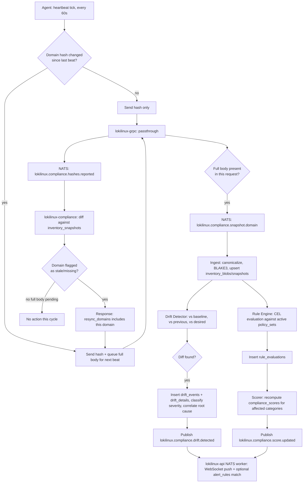
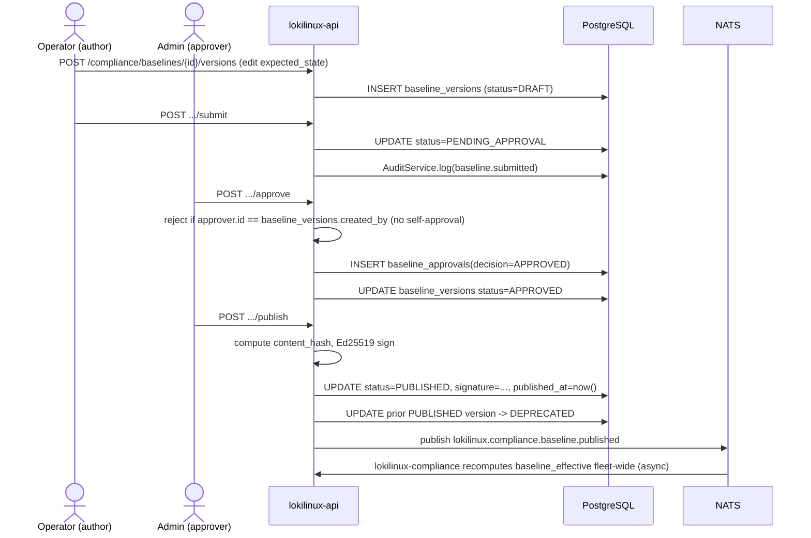
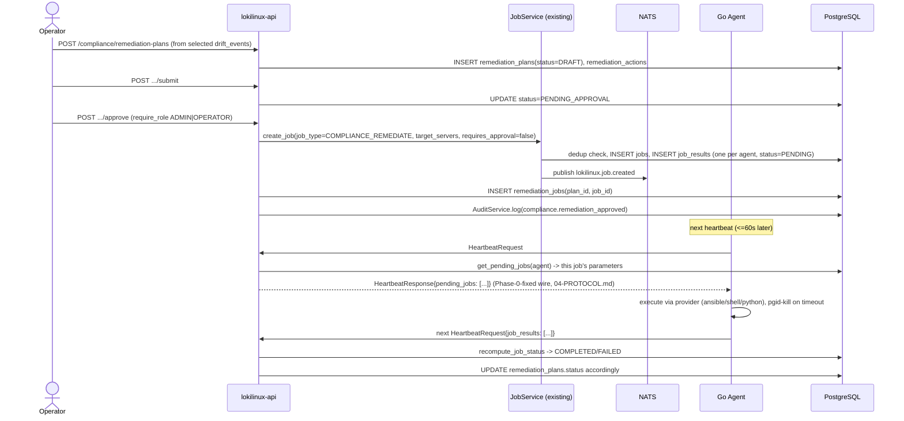
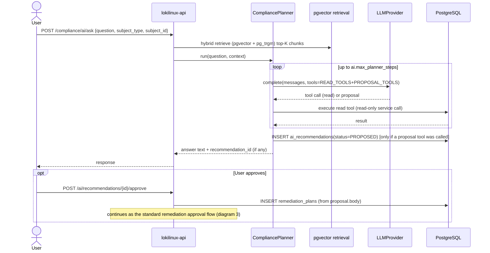
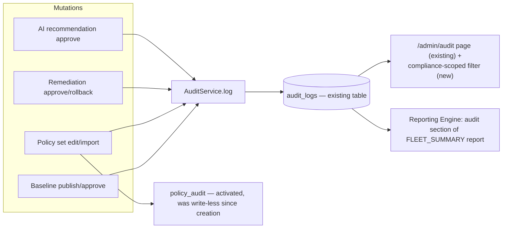

<!-- generated-by: claude -->
# Workflow & Sequence Diagrams

All diagrams are Mermaid, rendered natively by GitHub and by Claude Artifacts — no external
image assets to keep in sync with the design.

## 1. End-to-end scan cycle (workflow)

## 2. Baseline approval workflow

## 3. Remediation approval + execution (sequence)

## 4. AI recommendation → approved action (sequence)

## 5. Historical audit architecture

No new audit storage — this module is additional *writers* into the existing `audit_logs`
table (today only `routers/admin.py` writes to it) and the existing-but-dormant `policy_audit`
table, not a parallel audit trail.
